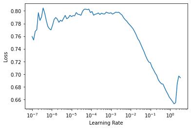

# TabNet for fastai
> This is an adaptation of TabNet (Attention-based network for tabular data) for fastai (>=2.0) library. The original paper https://arxiv.org/pdf/1908.07442.pdf. 


## Install

`pip install fast_tabnet`

## How to use

`model = TabNetModel(emb_szs, n_cont, out_sz, embed_p=0., y_range=None, 
                     n_d=8, n_a=8,
                     n_steps=3, gamma=1.5, 
                     n_independent=2, n_shared=2, epsilon=1e-15,
                     virtual_batch_size=128, momentum=0.02)`

Parameters `emb_szs, n_cont, out_sz, embed_p, y_range` are the same as for fastai TabularModel.

- n_d : int
    Dimension of the prediction  layer (usually between 4 and 64)
- n_a : int
    Dimension of the attention  layer (usually between 4 and 64)
- n_steps: int
    Number of sucessive steps in the newtork (usually betwenn 3 and 10)
- gamma : float
    Float above 1, scaling factor for attention updates (usually betwenn 1.0 to 2.0)
- momentum : float
    Float value between 0 and 1 which will be used for momentum in all batch norm
- n_independent : int
    Number of independent GLU layer in each GLU block (default 2)
- n_shared : int
    Number of independent GLU layer in each GLU block (default 2)
- epsilon: float
    Avoid log(0), this should be kept very low


## Example

Below is an example from fastai library, but the model in use is TabNet

```python
from fastai2.basics import *
from fastai2.tabular.all import *
from fast_tabnet.core import *
```

```python
path = untar_data(URLs.ADULT_SAMPLE)
df = pd.read_csv(path/'adult.csv')
df_main,df_test = df.iloc[:-1000].copy(),df.iloc[-1000:].copy()
df_main.head()
```


<div>
<style scoped>
    .dataframe tbody tr th:only-of-type {
        vertical-align: middle;
    }

    .dataframe tbody tr th {
        vertical-align: top;
    }

    .dataframe thead th {
        text-align: right;
    }
</style>
<table border="1" class="dataframe">
  <thead>
    <tr style="text-align: right;">
      <th></th>
      <th>age</th>
      <th>workclass</th>
      <th>fnlwgt</th>
      <th>education</th>
      <th>education-num</th>
      <th>marital-status</th>
      <th>occupation</th>
      <th>relationship</th>
      <th>race</th>
      <th>sex</th>
      <th>capital-gain</th>
      <th>capital-loss</th>
      <th>hours-per-week</th>
      <th>native-country</th>
      <th>salary</th>
    </tr>
  </thead>
  <tbody>
    <tr>
      <th>0</th>
      <td>49</td>
      <td>Private</td>
      <td>101320</td>
      <td>Assoc-acdm</td>
      <td>12.0</td>
      <td>Married-civ-spouse</td>
      <td>NaN</td>
      <td>Wife</td>
      <td>White</td>
      <td>Female</td>
      <td>0</td>
      <td>1902</td>
      <td>40</td>
      <td>United-States</td>
      <td>&gt;=50k</td>
    </tr>
    <tr>
      <th>1</th>
      <td>44</td>
      <td>Private</td>
      <td>236746</td>
      <td>Masters</td>
      <td>14.0</td>
      <td>Divorced</td>
      <td>Exec-managerial</td>
      <td>Not-in-family</td>
      <td>White</td>
      <td>Male</td>
      <td>10520</td>
      <td>0</td>
      <td>45</td>
      <td>United-States</td>
      <td>&gt;=50k</td>
    </tr>
    <tr>
      <th>2</th>
      <td>38</td>
      <td>Private</td>
      <td>96185</td>
      <td>HS-grad</td>
      <td>NaN</td>
      <td>Divorced</td>
      <td>NaN</td>
      <td>Unmarried</td>
      <td>Black</td>
      <td>Female</td>
      <td>0</td>
      <td>0</td>
      <td>32</td>
      <td>United-States</td>
      <td>&lt;50k</td>
    </tr>
    <tr>
      <th>3</th>
      <td>38</td>
      <td>Self-emp-inc</td>
      <td>112847</td>
      <td>Prof-school</td>
      <td>15.0</td>
      <td>Married-civ-spouse</td>
      <td>Prof-specialty</td>
      <td>Husband</td>
      <td>Asian-Pac-Islander</td>
      <td>Male</td>
      <td>0</td>
      <td>0</td>
      <td>40</td>
      <td>United-States</td>
      <td>&gt;=50k</td>
    </tr>
    <tr>
      <th>4</th>
      <td>42</td>
      <td>Self-emp-not-inc</td>
      <td>82297</td>
      <td>7th-8th</td>
      <td>NaN</td>
      <td>Married-civ-spouse</td>
      <td>Other-service</td>
      <td>Wife</td>
      <td>Black</td>
      <td>Female</td>
      <td>0</td>
      <td>0</td>
      <td>50</td>
      <td>United-States</td>
      <td>&lt;50k</td>
    </tr>
  </tbody>
</table>
</div>


```python
cat_names = ['workclass', 'education', 'marital-status', 'occupation', 
             'relationship', 'race', 'native-country', 'sex']
cont_names = ['age', 'fnlwgt', 'education-num']
procs = [Categorify, FillMissing, Normalize]
splits = RandomSplitter()(range_of(df_main))
```

```python
to = TabularPandas(df_main, procs, cat_names, cont_names, y_names="salary", y_block = CategoryBlock(), splits=splits)
```

```python
dls = to.dataloaders()
```

```python
dls.valid.show_batch()
```


<table border="1" class="dataframe">
  <thead>
    <tr style="text-align: right;">
      <th></th>
      <th>workclass</th>
      <th>education</th>
      <th>marital-status</th>
      <th>occupation</th>
      <th>relationship</th>
      <th>race</th>
      <th>native-country</th>
      <th>sex</th>
      <th>education-num_na</th>
      <th>age</th>
      <th>fnlwgt</th>
      <th>education-num</th>
      <th>salary</th>
    </tr>
  </thead>
  <tbody>
    <tr>
      <th>0</th>
      <td>Federal-gov</td>
      <td>Some-college</td>
      <td>Married-civ-spouse</td>
      <td>Adm-clerical</td>
      <td>Husband</td>
      <td>Black</td>
      <td>United-States</td>
      <td>Male</td>
      <td>False</td>
      <td>47.000000</td>
      <td>137917.000737</td>
      <td>10.0</td>
      <td>&gt;=50k</td>
    </tr>
    <tr>
      <th>1</th>
      <td>Private</td>
      <td>Some-college</td>
      <td>Married-civ-spouse</td>
      <td>Craft-repair</td>
      <td>Husband</td>
      <td>White</td>
      <td>United-States</td>
      <td>Male</td>
      <td>False</td>
      <td>38.000000</td>
      <td>186934.000065</td>
      <td>10.0</td>
      <td>&lt;50k</td>
    </tr>
    <tr>
      <th>2</th>
      <td>Private</td>
      <td>Some-college</td>
      <td>Divorced</td>
      <td>Tech-support</td>
      <td>Not-in-family</td>
      <td>White</td>
      <td>United-States</td>
      <td>Male</td>
      <td>False</td>
      <td>29.000000</td>
      <td>105597.998835</td>
      <td>10.0</td>
      <td>&lt;50k</td>
    </tr>
    <tr>
      <th>3</th>
      <td>Private</td>
      <td>Some-college</td>
      <td>Divorced</td>
      <td>Other-service</td>
      <td>Not-in-family</td>
      <td>White</td>
      <td>United-States</td>
      <td>Female</td>
      <td>False</td>
      <td>55.000000</td>
      <td>169070.999493</td>
      <td>10.0</td>
      <td>&lt;50k</td>
    </tr>
    <tr>
      <th>4</th>
      <td>Private</td>
      <td>HS-grad</td>
      <td>Divorced</td>
      <td>Adm-clerical</td>
      <td>Unmarried</td>
      <td>Black</td>
      <td>United-States</td>
      <td>Female</td>
      <td>False</td>
      <td>44.000000</td>
      <td>103217.997147</td>
      <td>9.0</td>
      <td>&lt;50k</td>
    </tr>
    <tr>
      <th>5</th>
      <td>Private</td>
      <td>Preschool</td>
      <td>Never-married</td>
      <td>Other-service</td>
      <td>Own-child</td>
      <td>White</td>
      <td>United-States</td>
      <td>Male</td>
      <td>False</td>
      <td>20.000000</td>
      <td>277700.002135</td>
      <td>1.0</td>
      <td>&lt;50k</td>
    </tr>
    <tr>
      <th>6</th>
      <td>Private</td>
      <td>Some-college</td>
      <td>Married-civ-spouse</td>
      <td>Sales</td>
      <td>Husband</td>
      <td>Black</td>
      <td>United-States</td>
      <td>Male</td>
      <td>False</td>
      <td>36.000000</td>
      <td>262687.998842</td>
      <td>10.0</td>
      <td>&gt;=50k</td>
    </tr>
    <tr>
      <th>7</th>
      <td>Private</td>
      <td>Assoc-acdm</td>
      <td>Married-civ-spouse</td>
      <td>Prof-specialty</td>
      <td>Wife</td>
      <td>White</td>
      <td>United-States</td>
      <td>Female</td>
      <td>False</td>
      <td>22.000001</td>
      <td>115244.002184</td>
      <td>12.0</td>
      <td>&lt;50k</td>
    </tr>
    <tr>
      <th>8</th>
      <td>Private</td>
      <td>Some-college</td>
      <td>Married-civ-spouse</td>
      <td>Transport-moving</td>
      <td>Husband</td>
      <td>White</td>
      <td>United-States</td>
      <td>Male</td>
      <td>False</td>
      <td>49.000000</td>
      <td>252078.998039</td>
      <td>10.0</td>
      <td>&gt;=50k</td>
    </tr>
    <tr>
      <th>9</th>
      <td>Private</td>
      <td>Bachelors</td>
      <td>Separated</td>
      <td>Sales</td>
      <td>Unmarried</td>
      <td>White</td>
      <td>United-States</td>
      <td>Female</td>
      <td>False</td>
      <td>41.000000</td>
      <td>173369.999256</td>
      <td>13.0</td>
      <td>&lt;50k</td>
    </tr>
  </tbody>
</table>


```python
to_tst = to.new(df_test)
to_tst.process()
to_tst.all_cols.head()
```


<div>
<style scoped>
    .dataframe tbody tr th:only-of-type {
        vertical-align: middle;
    }

    .dataframe tbody tr th {
        vertical-align: top;
    }

    .dataframe thead th {
        text-align: right;
    }
</style>
<table border="1" class="dataframe">
  <thead>
    <tr style="text-align: right;">
      <th></th>
      <th>workclass</th>
      <th>education</th>
      <th>marital-status</th>
      <th>occupation</th>
      <th>relationship</th>
      <th>race</th>
      <th>native-country</th>
      <th>sex</th>
      <th>education-num_na</th>
      <th>age</th>
      <th>fnlwgt</th>
      <th>education-num</th>
      <th>salary</th>
    </tr>
  </thead>
  <tbody>
    <tr>
      <th>31561</th>
      <td>5</td>
      <td>2</td>
      <td>5</td>
      <td>9</td>
      <td>3</td>
      <td>3</td>
      <td>40</td>
      <td>2</td>
      <td>1</td>
      <td>-1.506808</td>
      <td>-0.561532</td>
      <td>-1.207942</td>
      <td>0</td>
    </tr>
    <tr>
      <th>31562</th>
      <td>2</td>
      <td>12</td>
      <td>5</td>
      <td>2</td>
      <td>5</td>
      <td>3</td>
      <td>40</td>
      <td>1</td>
      <td>1</td>
      <td>-1.433470</td>
      <td>0.412441</td>
      <td>-0.423928</td>
      <td>0</td>
    </tr>
    <tr>
      <th>31563</th>
      <td>5</td>
      <td>7</td>
      <td>3</td>
      <td>4</td>
      <td>1</td>
      <td>5</td>
      <td>40</td>
      <td>2</td>
      <td>1</td>
      <td>-0.113384</td>
      <td>0.126033</td>
      <td>-1.991956</td>
      <td>0</td>
    </tr>
    <tr>
      <th>31564</th>
      <td>8</td>
      <td>12</td>
      <td>3</td>
      <td>9</td>
      <td>1</td>
      <td>5</td>
      <td>40</td>
      <td>2</td>
      <td>1</td>
      <td>1.500055</td>
      <td>0.738764</td>
      <td>-0.423928</td>
      <td>0</td>
    </tr>
    <tr>
      <th>31565</th>
      <td>1</td>
      <td>12</td>
      <td>1</td>
      <td>1</td>
      <td>5</td>
      <td>3</td>
      <td>40</td>
      <td>2</td>
      <td>1</td>
      <td>-0.480074</td>
      <td>7.472530</td>
      <td>-0.423928</td>
      <td>0</td>
    </tr>
  </tbody>
</table>
</div>


```python
emb_szs = get_emb_sz(to); print(emb_szs)
```

    [(10, 6), (17, 8), (8, 5), (16, 8), (7, 5), (6, 4), (43, 13), (3, 3), (3, 3)]


That's the use of the model

```python
model = TabNetModel(emb_szs, len(to.cont_names), dls.c, n_d=8, n_a=32, n_steps=1); 
```

```python
opt_func = partial(Adam, wd=0.01, eps=1e-5)
learn = Learner(dls, model, CrossEntropyLossFlat(), opt_func=opt_func, lr=3e-2, metrics=[accuracy])
```

```python
learn.lr_find()
```


    SuggestedLRs(lr_min=0.13182567358016967, lr_steep=0.17378008365631104)





```python
learn.fit_one_cycle(10)
```


<table border="1" class="dataframe">
  <thead>
    <tr style="text-align: left;">
      <th>epoch</th>
      <th>train_loss</th>
      <th>valid_loss</th>
      <th>accuracy</th>
      <th>time</th>
    </tr>
  </thead>
  <tbody>
    <tr>
      <td>0</td>
      <td>0.405069</td>
      <td>0.386984</td>
      <td>0.817491</td>
      <td>00:07</td>
    </tr>
    <tr>
      <td>1</td>
      <td>0.384802</td>
      <td>0.397211</td>
      <td>0.833809</td>
      <td>00:07</td>
    </tr>
    <tr>
      <td>2</td>
      <td>0.358762</td>
      <td>0.368313</td>
      <td>0.833809</td>
      <td>00:07</td>
    </tr>
    <tr>
      <td>3</td>
      <td>0.362615</td>
      <td>0.345754</td>
      <td>0.837452</td>
      <td>00:07</td>
    </tr>
    <tr>
      <td>4</td>
      <td>0.359549</td>
      <td>0.344609</td>
      <td>0.844106</td>
      <td>00:07</td>
    </tr>
    <tr>
      <td>5</td>
      <td>0.360541</td>
      <td>0.341664</td>
      <td>0.840938</td>
      <td>00:07</td>
    </tr>
    <tr>
      <td>6</td>
      <td>0.353671</td>
      <td>0.346765</td>
      <td>0.838086</td>
      <td>00:07</td>
    </tr>
    <tr>
      <td>7</td>
      <td>0.348572</td>
      <td>0.340566</td>
      <td>0.845374</td>
      <td>00:07</td>
    </tr>
    <tr>
      <td>8</td>
      <td>0.343425</td>
      <td>0.337662</td>
      <td>0.843948</td>
      <td>00:07</td>
    </tr>
    <tr>
      <td>9</td>
      <td>0.329840</td>
      <td>0.337043</td>
      <td>0.846800</td>
      <td>00:07</td>
    </tr>
  </tbody>
</table>


## Hyperparameter search with Bayesian Optimization

If your dataset isn't huge you can tune hyperparameters for tabular models with Bayesian Optimization. You can optimize directly your metric using this approach if the metric is sensitive enough (in our example it is not and we use validation loss instead). Also, you should create the second validation set, because you will use the first as a training set for Bayesian Optimization. 


You may need to install the optimizer `pip install bayesian-optimization`

```python
from functools import lru_cache
```

```python
# The function we'll optimize
@lru_cache(1000)
def get_accuracy(n_d:Int, n_a:Int, n_steps:Int):
    model = TabNetModel(emb_szs, len(to.cont_names), dls.c, n_d=n_d, n_a=n_a, n_steps=n_steps, gamma=1.5)
    learn = Learner(dls, model, CrossEntropyLossFlat(), opt_func=opt_func, lr=3e-2, metrics=[accuracy])
    learn.fit_one_cycle(5)
    return float(learn.validate(dl=learn.dls.valid)[1])
```

This implementation of Bayesian Optimization doesn't work naturally with descreet values. That's why we use wrapper with `lru_cache`.

```python
def fit_accuracy(pow_n_d, pow_n_a, pow_n_steps):
    n_d, n_a, n_steps = map(lambda x: 2**int(x), (pow_n_d, pow_n_a, pow_n_steps))
    return get_accuracy(n_d, n_a, n_steps)
```

```python
from bayes_opt import BayesianOptimization

# Bounded region of parameter space
pbounds = {'pow_n_d': (0, 8), 'pow_n_a': (0, 8), 'pow_n_steps': (0, 4)}

optimizer = BayesianOptimization(
    f=fit_accuracy,
    pbounds=pbounds,
)
```

```python
optimizer.maximize(
    init_points=15,
    n_iter=100,
)
```

    |   iter    |  target   |  pow_n_a  |  pow_n_d  | pow_n_... |
    -------------------------------------------------------------


<table border="1" class="dataframe">
  <thead>
    <tr style="text-align: left;">
      <th>epoch</th>
      <th>train_loss</th>
      <th>valid_loss</th>
      <th>accuracy</th>
      <th>time</th>
    </tr>
  </thead>
  <tbody>
    <tr>
      <td>0</td>
      <td>0.404888</td>
      <td>0.432834</td>
      <td>0.793885</td>
      <td>00:10</td>
    </tr>
    <tr>
      <td>1</td>
      <td>0.367979</td>
      <td>0.384840</td>
      <td>0.818600</td>
      <td>00:09</td>
    </tr>
    <tr>
      <td>2</td>
      <td>0.366444</td>
      <td>0.372005</td>
      <td>0.819708</td>
      <td>00:09</td>
    </tr>
    <tr>
      <td>3</td>
      <td>0.362771</td>
      <td>0.366949</td>
      <td>0.823511</td>
      <td>00:10</td>
    </tr>
    <tr>
      <td>4</td>
      <td>0.353682</td>
      <td>0.367132</td>
      <td>0.823511</td>
      <td>00:10</td>
    </tr>
  </tbody>
</table>


    |  1        |  0.8235   |  0.9408   |  1.898    |  1.652    |


<table border="1" class="dataframe">
  <thead>
    <tr style="text-align: left;">
      <th>epoch</th>
      <th>train_loss</th>
      <th>valid_loss</th>
      <th>accuracy</th>
      <th>time</th>
    </tr>
  </thead>
  <tbody>
    <tr>
      <td>0</td>
      <td>0.393301</td>
      <td>0.449742</td>
      <td>0.810836</td>
      <td>00:08</td>
    </tr>
    <tr>
      <td>1</td>
      <td>0.379140</td>
      <td>0.413773</td>
      <td>0.815589</td>
      <td>00:07</td>
    </tr>
    <tr>
      <td>2</td>
      <td>0.355790</td>
      <td>0.388907</td>
      <td>0.822560</td>
      <td>00:07</td>
    </tr>
    <tr>
      <td>3</td>
      <td>0.349984</td>
      <td>0.362671</td>
      <td>0.828739</td>
      <td>00:07</td>
    </tr>
    <tr>
      <td>4</td>
      <td>0.348000</td>
      <td>0.360150</td>
      <td>0.827313</td>
      <td>00:07</td>
    </tr>
  </tbody>
</table>


    |  2        |  0.8273   |  4.262    |  5.604    |  0.2437   |


<table border="1" class="dataframe">
  <thead>
    <tr style="text-align: left;">
      <th>epoch</th>
      <th>train_loss</th>
      <th>valid_loss</th>
      <th>accuracy</th>
      <th>time</th>
    </tr>
  </thead>
  <tbody>
    <tr>
      <td>0</td>
      <td>0.451572</td>
      <td>0.434189</td>
      <td>0.781210</td>
      <td>00:12</td>
    </tr>
    <tr>
      <td>1</td>
      <td>0.423763</td>
      <td>0.413420</td>
      <td>0.805450</td>
      <td>00:12</td>
    </tr>
    <tr>
      <td>2</td>
      <td>0.398922</td>
      <td>0.408688</td>
      <td>0.814164</td>
      <td>00:12</td>
    </tr>
    <tr>
      <td>3</td>
      <td>0.390981</td>
      <td>0.392398</td>
      <td>0.808935</td>
      <td>00:12</td>
    </tr>
    <tr>
      <td>4</td>
      <td>0.376418</td>
      <td>0.382250</td>
      <td>0.817174</td>
      <td>00:12</td>
    </tr>
  </tbody>
</table>


    |  3        |  0.8172   |  7.233    |  6.471    |  2.508    |


<table border="1" class="dataframe">
  <thead>
    <tr style="text-align: left;">
      <th>epoch</th>
      <th>train_loss</th>
      <th>valid_loss</th>
      <th>accuracy</th>
      <th>time</th>
    </tr>
  </thead>
  <tbody>
    <tr>
      <td>0</td>
      <td>0.403187</td>
      <td>0.413986</td>
      <td>0.798162</td>
      <td>00:07</td>
    </tr>
    <tr>
      <td>1</td>
      <td>0.398544</td>
      <td>0.390102</td>
      <td>0.820184</td>
      <td>00:07</td>
    </tr>
    <tr>
      <td>2</td>
      <td>0.390569</td>
      <td>0.389703</td>
      <td>0.825253</td>
      <td>00:07</td>
    </tr>
    <tr>
      <td>3</td>
      <td>0.375426</td>
      <td>0.385706</td>
      <td>0.826996</td>
      <td>00:07</td>
    </tr>
    <tr>
      <td>4</td>
      <td>0.370446</td>
      <td>0.383366</td>
      <td>0.831115</td>
      <td>00:06</td>
    </tr>
  </tbody>
</table>


    |  4        |  0.8311   |  5.935    |  1.241    |  0.3809   |


<table border="1" class="dataframe">
  <thead>
    <tr style="text-align: left;">
      <th>epoch</th>
      <th>train_loss</th>
      <th>valid_loss</th>
      <th>accuracy</th>
      <th>time</th>
    </tr>
  </thead>
  <tbody>
    <tr>
      <td>0</td>
      <td>0.464145</td>
      <td>0.458641</td>
      <td>0.751267</td>
      <td>00:18</td>
    </tr>
    <tr>
      <td>1</td>
      <td>0.424691</td>
      <td>0.436968</td>
      <td>0.788023</td>
      <td>00:18</td>
    </tr>
    <tr>
      <td>2</td>
      <td>0.431576</td>
      <td>0.436581</td>
      <td>0.775824</td>
      <td>00:18</td>
    </tr>
    <tr>
      <td>3</td>
      <td>0.432143</td>
      <td>0.437062</td>
      <td>0.759506</td>
      <td>00:18</td>
    </tr>
    <tr>
      <td>4</td>
      <td>0.429915</td>
      <td>0.438332</td>
      <td>0.758555</td>
      <td>00:18</td>
    </tr>
  </tbody>
</table>


    |  5        |  0.7586   |  2.554    |  0.4992   |  3.111    |


<table border="1" class="dataframe">
  <thead>
    <tr style="text-align: left;">
      <th>epoch</th>
      <th>train_loss</th>
      <th>valid_loss</th>
      <th>accuracy</th>
      <th>time</th>
    </tr>
  </thead>
  <tbody>
    <tr>
      <td>0</td>
      <td>0.470359</td>
      <td>0.475826</td>
      <td>0.748891</td>
      <td>00:12</td>
    </tr>
    <tr>
      <td>1</td>
      <td>0.411564</td>
      <td>0.409433</td>
      <td>0.797053</td>
      <td>00:12</td>
    </tr>
    <tr>
      <td>2</td>
      <td>0.392718</td>
      <td>0.397363</td>
      <td>0.809727</td>
      <td>00:12</td>
    </tr>
    <tr>
      <td>3</td>
      <td>0.387564</td>
      <td>0.380033</td>
      <td>0.814322</td>
      <td>00:12</td>
    </tr>
    <tr>
      <td>4</td>
      <td>0.374153</td>
      <td>0.378258</td>
      <td>0.818916</td>
      <td>00:12</td>
    </tr>
  </tbody>
</table>


    |  6        |  0.8189   |  4.592    |  2.138    |  2.824    |


<table border="1" class="dataframe">
  <thead>
    <tr style="text-align: left;">
      <th>epoch</th>
      <th>train_loss</th>
      <th>valid_loss</th>
      <th>accuracy</th>
      <th>time</th>
    </tr>
  </thead>
  <tbody>
    <tr>
      <td>0</td>
      <td>0.547042</td>
      <td>0.588752</td>
      <td>0.754119</td>
      <td>00:18</td>
    </tr>
    <tr>
      <td>1</td>
      <td>0.491731</td>
      <td>0.469795</td>
      <td>0.771863</td>
      <td>00:18</td>
    </tr>
    <tr>
      <td>2</td>
      <td>0.454340</td>
      <td>0.433961</td>
      <td>0.775190</td>
      <td>00:18</td>
    </tr>
    <tr>
      <td>3</td>
      <td>0.424386</td>
      <td>0.432385</td>
      <td>0.782953</td>
      <td>00:18</td>
    </tr>
    <tr>
      <td>4</td>
      <td>0.397645</td>
      <td>0.406420</td>
      <td>0.805767</td>
      <td>00:19</td>
    </tr>
  </tbody>
</table>


    |  7        |  0.8058   |  6.186    |  7.016    |  3.316    |


<table border="1" class="dataframe">
  <thead>
    <tr style="text-align: left;">
      <th>epoch</th>
      <th>train_loss</th>
      <th>valid_loss</th>
      <th>accuracy</th>
      <th>time</th>
    </tr>
  </thead>
  <tbody>
    <tr>
      <td>0</td>
      <td>0.485245</td>
      <td>0.487635</td>
      <td>0.751109</td>
      <td>00:18</td>
    </tr>
    <tr>
      <td>1</td>
      <td>0.450832</td>
      <td>0.446423</td>
      <td>0.750317</td>
      <td>00:18</td>
    </tr>
    <tr>
      <td>2</td>
      <td>0.448203</td>
      <td>0.449419</td>
      <td>0.755228</td>
      <td>00:18</td>
    </tr>
    <tr>
      <td>3</td>
      <td>0.430258</td>
      <td>0.443562</td>
      <td>0.744297</td>
      <td>00:18</td>
    </tr>
    <tr>
      <td>4</td>
      <td>0.429821</td>
      <td>0.437173</td>
      <td>0.761565</td>
      <td>00:18</td>
    </tr>
  </tbody>
</table>


    |  8        |  0.7616   |  2.018    |  1.316    |  3.675    |


<table border="1" class="dataframe">
  <thead>
    <tr style="text-align: left;">
      <th>epoch</th>
      <th>train_loss</th>
      <th>valid_loss</th>
      <th>accuracy</th>
      <th>time</th>
    </tr>
  </thead>
  <tbody>
    <tr>
      <td>0</td>
      <td>0.458425</td>
      <td>0.455733</td>
      <td>0.751584</td>
      <td>00:12</td>
    </tr>
    <tr>
      <td>1</td>
      <td>0.439781</td>
      <td>0.467807</td>
      <td>0.751109</td>
      <td>00:12</td>
    </tr>
    <tr>
      <td>2</td>
      <td>0.420331</td>
      <td>0.432216</td>
      <td>0.775190</td>
      <td>00:12</td>
    </tr>
    <tr>
      <td>3</td>
      <td>0.421012</td>
      <td>0.421412</td>
      <td>0.782319</td>
      <td>00:12</td>
    </tr>
    <tr>
      <td>4</td>
      <td>0.401828</td>
      <td>0.413434</td>
      <td>0.801014</td>
      <td>00:12</td>
    </tr>
  </tbody>
</table>


    |  9        |  0.801    |  2.051    |  1.958    |  2.332    |


<table border="1" class="dataframe">
  <thead>
    <tr style="text-align: left;">
      <th>epoch</th>
      <th>train_loss</th>
      <th>valid_loss</th>
      <th>accuracy</th>
      <th>time</th>
    </tr>
  </thead>
  <tbody>
    <tr>
      <td>0</td>
      <td>0.546997</td>
      <td>0.506728</td>
      <td>0.761407</td>
      <td>00:18</td>
    </tr>
    <tr>
      <td>1</td>
      <td>0.489712</td>
      <td>0.439324</td>
      <td>0.799588</td>
      <td>00:18</td>
    </tr>
    <tr>
      <td>2</td>
      <td>0.448558</td>
      <td>0.448419</td>
      <td>0.786122</td>
      <td>00:18</td>
    </tr>
    <tr>
      <td>3</td>
      <td>0.436869</td>
      <td>0.435375</td>
      <td>0.801648</td>
      <td>00:18</td>
    </tr>
    <tr>
      <td>4</td>
      <td>0.417128</td>
      <td>0.421093</td>
      <td>0.798321</td>
      <td>00:18</td>
    </tr>
  </tbody>
</table>


    |  10       |  0.7983   |  5.203    |  7.719    |  3.407    |


<table border="1" class="dataframe">
  <thead>
    <tr style="text-align: left;">
      <th>epoch</th>
      <th>train_loss</th>
      <th>valid_loss</th>
      <th>accuracy</th>
      <th>time</th>
    </tr>
  </thead>
  <tbody>
    <tr>
      <td>0</td>
      <td>0.380781</td>
      <td>0.463409</td>
      <td>0.786439</td>
      <td>00:07</td>
    </tr>
    <tr>
      <td>1</td>
      <td>0.359212</td>
      <td>0.461147</td>
      <td>0.798321</td>
      <td>00:07</td>
    </tr>
    <tr>
      <td>2</td>
      <td>0.351414</td>
      <td>0.368950</td>
      <td>0.822719</td>
      <td>00:07</td>
    </tr>
    <tr>
      <td>3</td>
      <td>0.347257</td>
      <td>0.367056</td>
      <td>0.829373</td>
      <td>00:07</td>
    </tr>
    <tr>
      <td>4</td>
      <td>0.337212</td>
      <td>0.362375</td>
      <td>0.830799</td>
      <td>00:07</td>
    </tr>
  </tbody>
</table>


    |  11       |  0.8308   |  6.048    |  4.376    |  0.08141  |


<table border="1" class="dataframe">
  <thead>
    <tr style="text-align: left;">
      <th>epoch</th>
      <th>train_loss</th>
      <th>valid_loss</th>
      <th>accuracy</th>
      <th>time</th>
    </tr>
  </thead>
  <tbody>
    <tr>
      <td>0</td>
      <td>0.430772</td>
      <td>0.430897</td>
      <td>0.767744</td>
      <td>00:12</td>
    </tr>
    <tr>
      <td>1</td>
      <td>0.402611</td>
      <td>0.432137</td>
      <td>0.764259</td>
      <td>00:12</td>
    </tr>
    <tr>
      <td>2</td>
      <td>0.407579</td>
      <td>0.409651</td>
      <td>0.812104</td>
      <td>00:12</td>
    </tr>
    <tr>
      <td>3</td>
      <td>0.374988</td>
      <td>0.391822</td>
      <td>0.816698</td>
      <td>00:12</td>
    </tr>
    <tr>
      <td>4</td>
      <td>0.378011</td>
      <td>0.389278</td>
      <td>0.816065</td>
      <td>00:12</td>
    </tr>
  </tbody>
</table>


    |  12       |  0.8161   |  7.083    |  1.385    |  2.806    |


<table border="1" class="dataframe">
  <thead>
    <tr style="text-align: left;">
      <th>epoch</th>
      <th>train_loss</th>
      <th>valid_loss</th>
      <th>accuracy</th>
      <th>time</th>
    </tr>
  </thead>
  <tbody>
    <tr>
      <td>0</td>
      <td>0.402018</td>
      <td>0.412051</td>
      <td>0.812262</td>
      <td>00:09</td>
    </tr>
    <tr>
      <td>1</td>
      <td>0.372804</td>
      <td>0.464937</td>
      <td>0.811629</td>
      <td>00:09</td>
    </tr>
    <tr>
      <td>2</td>
      <td>0.368274</td>
      <td>0.384675</td>
      <td>0.820184</td>
      <td>00:09</td>
    </tr>
    <tr>
      <td>3</td>
      <td>0.364502</td>
      <td>0.371920</td>
      <td>0.820659</td>
      <td>00:09</td>
    </tr>
    <tr>
      <td>4</td>
      <td>0.348998</td>
      <td>0.369445</td>
      <td>0.823828</td>
      <td>00:09</td>
    </tr>
  </tbody>
</table>


    |  13       |  0.8238   |  4.812    |  3.785    |  1.396    |
    |  14       |  0.8172   |  7.672    |  6.719    |  2.72     |


<table border="1" class="dataframe">
  <thead>
    <tr style="text-align: left;">
      <th>epoch</th>
      <th>train_loss</th>
      <th>valid_loss</th>
      <th>accuracy</th>
      <th>time</th>
    </tr>
  </thead>
  <tbody>
    <tr>
      <td>0</td>
      <td>0.476033</td>
      <td>0.442598</td>
      <td>0.803549</td>
      <td>00:12</td>
    </tr>
    <tr>
      <td>1</td>
      <td>0.405236</td>
      <td>0.414015</td>
      <td>0.788973</td>
      <td>00:11</td>
    </tr>
    <tr>
      <td>2</td>
      <td>0.406291</td>
      <td>0.451269</td>
      <td>0.789449</td>
      <td>00:11</td>
    </tr>
    <tr>
      <td>3</td>
      <td>0.391013</td>
      <td>0.393243</td>
      <td>0.816065</td>
      <td>00:12</td>
    </tr>
    <tr>
      <td>4</td>
      <td>0.374160</td>
      <td>0.377635</td>
      <td>0.821451</td>
      <td>00:12</td>
    </tr>
  </tbody>
</table>


    |  15       |  0.8215   |  6.464    |  7.954    |  2.647    |


<table border="1" class="dataframe">
  <thead>
    <tr style="text-align: left;">
      <th>epoch</th>
      <th>train_loss</th>
      <th>valid_loss</th>
      <th>accuracy</th>
      <th>time</th>
    </tr>
  </thead>
  <tbody>
    <tr>
      <td>0</td>
      <td>0.390142</td>
      <td>0.390678</td>
      <td>0.810995</td>
      <td>00:06</td>
    </tr>
    <tr>
      <td>1</td>
      <td>0.381717</td>
      <td>0.382202</td>
      <td>0.813055</td>
      <td>00:06</td>
    </tr>
    <tr>
      <td>2</td>
      <td>0.368564</td>
      <td>0.378705</td>
      <td>0.823828</td>
      <td>00:06</td>
    </tr>
    <tr>
      <td>3</td>
      <td>0.358858</td>
      <td>0.368329</td>
      <td>0.823511</td>
      <td>00:07</td>
    </tr>
    <tr>
      <td>4</td>
      <td>0.353392</td>
      <td>0.363913</td>
      <td>0.825887</td>
      <td>00:06</td>
    </tr>
  </tbody>
</table>


    |  16       |  0.8259   |  0.1229   |  7.83     |  0.3708   |


<table border="1" class="dataframe">
  <thead>
    <tr style="text-align: left;">
      <th>epoch</th>
      <th>train_loss</th>
      <th>valid_loss</th>
      <th>accuracy</th>
      <th>time</th>
    </tr>
  </thead>
  <tbody>
    <tr>
      <td>0</td>
      <td>0.381215</td>
      <td>0.422651</td>
      <td>0.800697</td>
      <td>00:06</td>
    </tr>
    <tr>
      <td>1</td>
      <td>0.377345</td>
      <td>0.380863</td>
      <td>0.815906</td>
      <td>00:06</td>
    </tr>
    <tr>
      <td>2</td>
      <td>0.366631</td>
      <td>0.370579</td>
      <td>0.822877</td>
      <td>00:06</td>
    </tr>
    <tr>
      <td>3</td>
      <td>0.362745</td>
      <td>0.366619</td>
      <td>0.823352</td>
      <td>00:07</td>
    </tr>
    <tr>
      <td>4</td>
      <td>0.356861</td>
      <td>0.364835</td>
      <td>0.825887</td>
      <td>00:07</td>
    </tr>
  </tbody>
</table>


    |  17       |  0.8259   |  0.03098  |  3.326    |  0.007025 |


<table border="1" class="dataframe">
  <thead>
    <tr style="text-align: left;">
      <th>epoch</th>
      <th>train_loss</th>
      <th>valid_loss</th>
      <th>accuracy</th>
      <th>time</th>
    </tr>
  </thead>
  <tbody>
    <tr>
      <td>0</td>
      <td>0.404604</td>
      <td>0.443035</td>
      <td>0.824461</td>
      <td>00:07</td>
    </tr>
    <tr>
      <td>1</td>
      <td>0.361872</td>
      <td>0.388880</td>
      <td>0.823669</td>
      <td>00:06</td>
    </tr>
    <tr>
      <td>2</td>
      <td>0.375164</td>
      <td>0.369968</td>
      <td>0.825095</td>
      <td>00:06</td>
    </tr>
    <tr>
      <td>3</td>
      <td>0.352091</td>
      <td>0.363823</td>
      <td>0.827947</td>
      <td>00:06</td>
    </tr>
    <tr>
      <td>4</td>
      <td>0.335458</td>
      <td>0.362544</td>
      <td>0.829373</td>
      <td>00:07</td>
    </tr>
  </tbody>
</table>


    |  18       |  0.8294   |  7.81     |  7.976    |  0.0194   |


<table border="1" class="dataframe">
  <thead>
    <tr style="text-align: left;">
      <th>epoch</th>
      <th>train_loss</th>
      <th>valid_loss</th>
      <th>accuracy</th>
      <th>time</th>
    </tr>
  </thead>
  <tbody>
    <tr>
      <td>0</td>
      <td>0.679292</td>
      <td>0.677299</td>
      <td>0.248891</td>
      <td>00:05</td>
    </tr>
    <tr>
      <td>1</td>
      <td>0.675403</td>
      <td>0.678406</td>
      <td>0.248891</td>
      <td>00:05</td>
    </tr>
    <tr>
      <td>2</td>
      <td>0.673259</td>
      <td>0.673374</td>
      <td>0.248891</td>
      <td>00:06</td>
    </tr>
    <tr>
      <td>3</td>
      <td>0.674996</td>
      <td>0.673514</td>
      <td>0.248891</td>
      <td>00:07</td>
    </tr>
    <tr>
      <td>4</td>
      <td>0.668813</td>
      <td>0.673671</td>
      <td>0.248891</td>
      <td>00:07</td>
    </tr>
  </tbody>
</table>


    |  19       |  0.2489   |  0.4499   |  0.138    |  0.001101 |


<table border="1" class="dataframe">
  <thead>
    <tr style="text-align: left;">
      <th>epoch</th>
      <th>train_loss</th>
      <th>valid_loss</th>
      <th>accuracy</th>
      <th>time</th>
    </tr>
  </thead>
  <tbody>
    <tr>
      <td>0</td>
      <td>0.524201</td>
      <td>0.528132</td>
      <td>0.729880</td>
      <td>00:30</td>
    </tr>
    <tr>
      <td>1</td>
      <td>0.419377</td>
      <td>0.403198</td>
      <td>0.812104</td>
      <td>00:31</td>
    </tr>
    <tr>
      <td>2</td>
      <td>0.399398</td>
      <td>0.418890</td>
      <td>0.812421</td>
      <td>00:31</td>
    </tr>
    <tr>
      <td>3</td>
      <td>0.381651</td>
      <td>0.391744</td>
      <td>0.819075</td>
      <td>00:31</td>
    </tr>
    <tr>
      <td>4</td>
      <td>0.368742</td>
      <td>0.377904</td>
      <td>0.822085</td>
      <td>00:31</td>
    </tr>
  </tbody>
</table>


    |  20       |  0.8221   |  0.0      |  6.575    |  4.0      |


<table border="1" class="dataframe">
  <thead>
    <tr style="text-align: left;">
      <th>epoch</th>
      <th>train_loss</th>
      <th>valid_loss</th>
      <th>accuracy</th>
      <th>time</th>
    </tr>
  </thead>
  <tbody>
    <tr>
      <td>0</td>
      <td>0.681083</td>
      <td>0.682397</td>
      <td>0.248891</td>
      <td>00:05</td>
    </tr>
    <tr>
      <td>1</td>
      <td>0.672935</td>
      <td>0.679371</td>
      <td>0.248891</td>
      <td>00:06</td>
    </tr>
    <tr>
      <td>2</td>
      <td>0.675200</td>
      <td>0.673466</td>
      <td>0.248891</td>
      <td>00:06</td>
    </tr>
    <tr>
      <td>3</td>
      <td>0.674251</td>
      <td>0.673356</td>
      <td>0.248891</td>
      <td>00:06</td>
    </tr>
    <tr>
      <td>4</td>
      <td>0.668861</td>
      <td>0.673186</td>
      <td>0.248891</td>
      <td>00:06</td>
    </tr>
  </tbody>
</table>


    |  21       |  0.2489   |  8.0      |  0.0      |  0.0      |


<table border="1" class="dataframe">
  <thead>
    <tr style="text-align: left;">
      <th>epoch</th>
      <th>train_loss</th>
      <th>valid_loss</th>
      <th>accuracy</th>
      <th>time</th>
    </tr>
  </thead>
  <tbody>
    <tr>
      <td>0</td>
      <td>0.407246</td>
      <td>0.432203</td>
      <td>0.801331</td>
      <td>00:10</td>
    </tr>
    <tr>
      <td>1</td>
      <td>0.385086</td>
      <td>0.399513</td>
      <td>0.811312</td>
      <td>00:11</td>
    </tr>
    <tr>
      <td>2</td>
      <td>0.377365</td>
      <td>0.384121</td>
      <td>0.816065</td>
      <td>00:12</td>
    </tr>
    <tr>
      <td>3</td>
      <td>0.366855</td>
      <td>0.371010</td>
      <td>0.823194</td>
      <td>00:12</td>
    </tr>
    <tr>
      <td>4</td>
      <td>0.361931</td>
      <td>0.368933</td>
      <td>0.825095</td>
      <td>00:12</td>
    </tr>
  </tbody>
</table>


    |  22       |  0.8251   |  0.0      |  4.502    |  2.193    |


<table border="1" class="dataframe">
  <thead>
    <tr style="text-align: left;">
      <th>epoch</th>
      <th>train_loss</th>
      <th>valid_loss</th>
      <th>accuracy</th>
      <th>time</th>
    </tr>
  </thead>
  <tbody>
    <tr>
      <td>0</td>
      <td>0.493623</td>
      <td>0.476921</td>
      <td>0.766001</td>
      <td>00:30</td>
    </tr>
    <tr>
      <td>1</td>
      <td>0.441126</td>
      <td>0.443774</td>
      <td>0.776774</td>
      <td>00:31</td>
    </tr>
    <tr>
      <td>2</td>
      <td>0.424523</td>
      <td>0.437125</td>
      <td>0.783904</td>
      <td>00:31</td>
    </tr>
    <tr>
      <td>3</td>
      <td>0.402457</td>
      <td>0.408628</td>
      <td>0.795944</td>
      <td>00:31</td>
    </tr>
    <tr>
      <td>4</td>
      <td>0.439420</td>
      <td>0.431756</td>
      <td>0.788973</td>
      <td>00:32</td>
    </tr>
  </tbody>
</table>


    |  23       |  0.789    |  8.0      |  3.702    |  4.0      |


<table border="1" class="dataframe">
  <thead>
    <tr style="text-align: left;">
      <th>epoch</th>
      <th>train_loss</th>
      <th>valid_loss</th>
      <th>accuracy</th>
      <th>time</th>
    </tr>
  </thead>
  <tbody>
    <tr>
      <td>0</td>
      <td>0.515615</td>
      <td>0.513919</td>
      <td>0.751109</td>
      <td>00:31</td>
    </tr>
    <tr>
      <td>1</td>
      <td>0.462674</td>
      <td>0.495322</td>
      <td>0.751584</td>
      <td>00:31</td>
    </tr>
    <tr>
      <td>2</td>
      <td>0.465430</td>
      <td>0.483685</td>
      <td>0.751267</td>
      <td>00:31</td>
    </tr>
    <tr>
      <td>3</td>
      <td>0.481308</td>
      <td>0.495375</td>
      <td>0.755070</td>
      <td>00:31</td>
    </tr>
    <tr>
      <td>4</td>
      <td>0.481324</td>
      <td>0.491275</td>
      <td>0.754911</td>
      <td>00:32</td>
    </tr>
  </tbody>
</table>


    |  24       |  0.7549   |  6.009    |  0.0      |  4.0      |


<table border="1" class="dataframe">
  <thead>
    <tr style="text-align: left;">
      <th>epoch</th>
      <th>train_loss</th>
      <th>valid_loss</th>
      <th>accuracy</th>
      <th>time</th>
    </tr>
  </thead>
  <tbody>
    <tr>
      <td>0</td>
      <td>0.422837</td>
      <td>0.403953</td>
      <td>0.819392</td>
      <td>00:06</td>
    </tr>
    <tr>
      <td>1</td>
      <td>0.380753</td>
      <td>0.367345</td>
      <td>0.826838</td>
      <td>00:06</td>
    </tr>
    <tr>
      <td>2</td>
      <td>0.353045</td>
      <td>0.365174</td>
      <td>0.830006</td>
      <td>00:07</td>
    </tr>
    <tr>
      <td>3</td>
      <td>0.348628</td>
      <td>0.364282</td>
      <td>0.826362</td>
      <td>00:07</td>
    </tr>
    <tr>
      <td>4</td>
      <td>0.343561</td>
      <td>0.361509</td>
      <td>0.829214</td>
      <td>00:07</td>
    </tr>
  </tbody>
</table>


    |  25       |  0.8292   |  3.522    |  8.0      |  0.0      |


<table border="1" class="dataframe">
  <thead>
    <tr style="text-align: left;">
      <th>epoch</th>
      <th>train_loss</th>
      <th>valid_loss</th>
      <th>accuracy</th>
      <th>time</th>
    </tr>
  </thead>
  <tbody>
    <tr>
      <td>0</td>
      <td>0.807766</td>
      <td>1.307279</td>
      <td>0.481622</td>
      <td>00:31</td>
    </tr>
    <tr>
      <td>1</td>
      <td>0.513308</td>
      <td>0.499470</td>
      <td>0.783587</td>
      <td>00:32</td>
    </tr>
    <tr>
      <td>2</td>
      <td>0.445906</td>
      <td>0.492620</td>
      <td>0.798004</td>
      <td>00:31</td>
    </tr>
    <tr>
      <td>3</td>
      <td>0.385094</td>
      <td>0.399986</td>
      <td>0.807509</td>
      <td>00:32</td>
    </tr>
    <tr>
      <td>4</td>
      <td>0.387228</td>
      <td>0.384739</td>
      <td>0.817015</td>
      <td>00:31</td>
    </tr>
  </tbody>
</table>


    |  26       |  0.817    |  0.0      |  8.0      |  4.0      |


<table border="1" class="dataframe">
  <thead>
    <tr style="text-align: left;">
      <th>epoch</th>
      <th>train_loss</th>
      <th>valid_loss</th>
      <th>accuracy</th>
      <th>time</th>
    </tr>
  </thead>
  <tbody>
    <tr>
      <td>0</td>
      <td>0.442076</td>
      <td>0.491338</td>
      <td>0.755387</td>
      <td>00:31</td>
    </tr>
    <tr>
      <td>1</td>
      <td>0.441078</td>
      <td>0.443674</td>
      <td>0.760773</td>
      <td>00:31</td>
    </tr>
    <tr>
      <td>2</td>
      <td>0.417575</td>
      <td>0.418758</td>
      <td>0.792142</td>
      <td>00:31</td>
    </tr>
    <tr>
      <td>3</td>
      <td>0.410825</td>
      <td>0.417581</td>
      <td>0.788498</td>
      <td>00:34</td>
    </tr>
    <tr>
      <td>4</td>
      <td>0.403407</td>
      <td>0.410941</td>
      <td>0.798321</td>
      <td>00:46</td>
    </tr>
  </tbody>
</table>


    |  27       |  0.7983   |  0.0      |  0.0      |  4.0      |


<table border="1" class="dataframe">
  <thead>
    <tr style="text-align: left;">
      <th>epoch</th>
      <th>train_loss</th>
      <th>valid_loss</th>
      <th>accuracy</th>
      <th>time</th>
    </tr>
  </thead>
  <tbody>
    <tr>
      <td>0</td>
      <td>0.407006</td>
      <td>0.419679</td>
      <td>0.792142</td>
      <td>00:08</td>
    </tr>
    <tr>
      <td>1</td>
      <td>0.390913</td>
      <td>0.392631</td>
      <td>0.810520</td>
      <td>00:08</td>
    </tr>
    <tr>
      <td>2</td>
      <td>0.365560</td>
      <td>0.394330</td>
      <td>0.817491</td>
      <td>00:08</td>
    </tr>
    <tr>
      <td>3</td>
      <td>0.378459</td>
      <td>0.387244</td>
      <td>0.820659</td>
      <td>00:08</td>
    </tr>
    <tr>
      <td>4</td>
      <td>0.375275</td>
      <td>0.385417</td>
      <td>0.828897</td>
      <td>00:08</td>
    </tr>
  </tbody>
</table>


    |  28       |  0.8289   |  3.379    |  2.848    |  0.0      |


<table border="1" class="dataframe">
  <thead>
    <tr style="text-align: left;">
      <th>epoch</th>
      <th>train_loss</th>
      <th>valid_loss</th>
      <th>accuracy</th>
      <th>time</th>
    </tr>
  </thead>
  <tbody>
    <tr>
      <td>0</td>
      <td>0.430604</td>
      <td>0.469592</td>
      <td>0.781210</td>
      <td>00:45</td>
    </tr>
    <tr>
      <td>1</td>
      <td>0.423074</td>
      <td>0.429704</td>
      <td>0.797529</td>
      <td>00:45</td>
    </tr>
    <tr>
      <td>2</td>
      <td>0.400120</td>
      <td>0.393398</td>
      <td>0.810995</td>
      <td>00:45</td>
    </tr>
    <tr>
      <td>3</td>
      <td>0.382361</td>
      <td>0.390651</td>
      <td>0.816065</td>
      <td>00:46</td>
    </tr>
    <tr>
      <td>4</td>
      <td>0.389520</td>
      <td>0.401878</td>
      <td>0.807193</td>
      <td>00:46</td>
    </tr>
  </tbody>
</table>


    |  29       |  0.8072   |  0.0      |  2.588    |  4.0      |


<table border="1" class="dataframe">
  <thead>
    <tr style="text-align: left;">
      <th>epoch</th>
      <th>train_loss</th>
      <th>valid_loss</th>
      <th>accuracy</th>
      <th>time</th>
    </tr>
  </thead>
  <tbody>
    <tr>
      <td>0</td>
      <td>0.396348</td>
      <td>0.397454</td>
      <td>0.806717</td>
      <td>00:08</td>
    </tr>
    <tr>
      <td>1</td>
      <td>0.383342</td>
      <td>0.386023</td>
      <td>0.819550</td>
      <td>00:07</td>
    </tr>
    <tr>
      <td>2</td>
      <td>0.369493</td>
      <td>0.374401</td>
      <td>0.820025</td>
      <td>00:07</td>
    </tr>
    <tr>
      <td>3</td>
      <td>0.356015</td>
      <td>0.366535</td>
      <td>0.826204</td>
      <td>00:08</td>
    </tr>
    <tr>
      <td>4</td>
      <td>0.341073</td>
      <td>0.365241</td>
      <td>0.826204</td>
      <td>00:08</td>
    </tr>
  </tbody>
</table>


    |  30       |  0.8262   |  1.217    |  5.622    |  0.0      |


<table border="1" class="dataframe">
  <thead>
    <tr style="text-align: left;">
      <th>epoch</th>
      <th>train_loss</th>
      <th>valid_loss</th>
      <th>accuracy</th>
      <th>time</th>
    </tr>
  </thead>
  <tbody>
    <tr>
      <td>0</td>
      <td>0.809077</td>
      <td>0.480591</td>
      <td>0.782795</td>
      <td>00:45</td>
    </tr>
    <tr>
      <td>1</td>
      <td>0.571318</td>
      <td>0.497731</td>
      <td>0.739068</td>
      <td>00:45</td>
    </tr>
    <tr>
      <td>2</td>
      <td>0.514562</td>
      <td>0.461726</td>
      <td>0.781527</td>
      <td>00:45</td>
    </tr>
    <tr>
      <td>3</td>
      <td>0.439822</td>
      <td>0.451722</td>
      <td>0.787231</td>
      <td>00:44</td>
    </tr>
    <tr>
      <td>4</td>
      <td>0.419881</td>
      <td>0.422125</td>
      <td>0.801648</td>
      <td>00:45</td>
    </tr>
  </tbody>
</table>


    |  31       |  0.8016   |  8.0      |  8.0      |  4.0      |


<table border="1" class="dataframe">
  <thead>
    <tr style="text-align: left;">
      <th>epoch</th>
      <th>train_loss</th>
      <th>valid_loss</th>
      <th>accuracy</th>
      <th>time</th>
    </tr>
  </thead>
  <tbody>
    <tr>
      <td>0</td>
      <td>0.410521</td>
      <td>0.435045</td>
      <td>0.810044</td>
      <td>00:08</td>
    </tr>
    <tr>
      <td>1</td>
      <td>0.363098</td>
      <td>0.378001</td>
      <td>0.821926</td>
      <td>00:08</td>
    </tr>
    <tr>
      <td>2</td>
      <td>0.359525</td>
      <td>0.364477</td>
      <td>0.827788</td>
      <td>00:08</td>
    </tr>
    <tr>
      <td>3</td>
      <td>0.354005</td>
      <td>0.366507</td>
      <td>0.821610</td>
      <td>00:08</td>
    </tr>
    <tr>
      <td>4</td>
      <td>0.347293</td>
      <td>0.362657</td>
      <td>0.829373</td>
      <td>00:08</td>
    </tr>
  </tbody>
</table>


    |  32       |  0.8294   |  5.864    |  8.0      |  0.0      |


<table border="1" class="dataframe">
  <thead>
    <tr style="text-align: left;">
      <th>epoch</th>
      <th>train_loss</th>
      <th>valid_loss</th>
      <th>accuracy</th>
      <th>time</th>
    </tr>
  </thead>
  <tbody>
    <tr>
      <td>0</td>
      <td>0.498376</td>
      <td>0.436696</td>
      <td>0.794043</td>
      <td>00:16</td>
    </tr>
    <tr>
      <td>1</td>
      <td>0.411699</td>
      <td>0.435537</td>
      <td>0.801331</td>
      <td>00:16</td>
    </tr>
    <tr>
      <td>2</td>
      <td>0.385327</td>
      <td>0.396916</td>
      <td>0.820184</td>
      <td>00:16</td>
    </tr>
    <tr>
      <td>3</td>
      <td>0.382020</td>
      <td>0.389856</td>
      <td>0.813371</td>
      <td>00:16</td>
    </tr>
    <tr>
      <td>4</td>
      <td>0.373869</td>
      <td>0.377804</td>
      <td>0.820817</td>
      <td>00:15</td>
    </tr>
  </tbody>
</table>


    |  33       |  0.8208   |  1.776    |  8.0      |  2.212    |


<table border="1" class="dataframe">
  <thead>
    <tr style="text-align: left;">
      <th>epoch</th>
      <th>train_loss</th>
      <th>valid_loss</th>
      <th>accuracy</th>
      <th>time</th>
    </tr>
  </thead>
  <tbody>
    <tr>
      <td>0</td>
      <td>0.404653</td>
      <td>0.440106</td>
      <td>0.772180</td>
      <td>00:11</td>
    </tr>
    <tr>
      <td>1</td>
      <td>0.377931</td>
      <td>0.393715</td>
      <td>0.817332</td>
      <td>00:11</td>
    </tr>
    <tr>
      <td>2</td>
      <td>0.373221</td>
      <td>0.379273</td>
      <td>0.826838</td>
      <td>00:11</td>
    </tr>
    <tr>
      <td>3</td>
      <td>0.359682</td>
      <td>0.362844</td>
      <td>0.828422</td>
      <td>00:11</td>
    </tr>
    <tr>
      <td>4</td>
      <td>0.340384</td>
      <td>0.363072</td>
      <td>0.828897</td>
      <td>00:11</td>
    </tr>
  </tbody>
</table>


    |  34       |  0.8289   |  5.777    |  2.2      |  1.31     |


<table border="1" class="dataframe">
  <thead>
    <tr style="text-align: left;">
      <th>epoch</th>
      <th>train_loss</th>
      <th>valid_loss</th>
      <th>accuracy</th>
      <th>time</th>
    </tr>
  </thead>
  <tbody>
    <tr>
      <td>0</td>
      <td>0.520308</td>
      <td>0.503207</td>
      <td>0.749208</td>
      <td>00:45</td>
    </tr>
    <tr>
      <td>1</td>
      <td>0.472501</td>
      <td>0.451469</td>
      <td>0.780418</td>
      <td>00:45</td>
    </tr>
    <tr>
      <td>2</td>
      <td>0.454686</td>
      <td>0.429175</td>
      <td>0.784854</td>
      <td>00:45</td>
    </tr>
    <tr>
      <td>3</td>
      <td>0.400800</td>
      <td>0.413727</td>
      <td>0.795469</td>
      <td>00:44</td>
    </tr>
    <tr>
      <td>4</td>
      <td>0.405604</td>
      <td>0.409770</td>
      <td>0.801648</td>
      <td>00:45</td>
    </tr>
  </tbody>
</table>


    |  35       |  0.8016   |  2.748    |  5.915    |  4.0      |


<table border="1" class="dataframe">
  <thead>
    <tr style="text-align: left;">
      <th>epoch</th>
      <th>train_loss</th>
      <th>valid_loss</th>
      <th>accuracy</th>
      <th>time</th>
    </tr>
  </thead>
  <tbody>
    <tr>
      <td>0</td>
      <td>0.504537</td>
      <td>0.501541</td>
      <td>0.750317</td>
      <td>00:45</td>
    </tr>
    <tr>
      <td>1</td>
      <td>0.465937</td>
      <td>0.477715</td>
      <td>0.773289</td>
      <td>00:45</td>
    </tr>
    <tr>
      <td>2</td>
      <td>0.435364</td>
      <td>0.481415</td>
      <td>0.766635</td>
      <td>00:45</td>
    </tr>
    <tr>
      <td>3</td>
      <td>0.425434</td>
      <td>0.442198</td>
      <td>0.772814</td>
      <td>00:45</td>
    </tr>
    <tr>
      <td>4</td>
      <td>0.425779</td>
      <td>0.458947</td>
      <td>0.771863</td>
      <td>00:45</td>
    </tr>
  </tbody>
</table>


    |  36       |  0.7719   |  6.251    |  2.532    |  4.0      |


<table border="1" class="dataframe">
  <thead>
    <tr style="text-align: left;">
      <th>epoch</th>
      <th>train_loss</th>
      <th>valid_loss</th>
      <th>accuracy</th>
      <th>time</th>
    </tr>
  </thead>
  <tbody>
    <tr>
      <td>0</td>
      <td>0.420782</td>
      <td>0.420721</td>
      <td>0.791350</td>
      <td>00:10</td>
    </tr>
    <tr>
      <td>1</td>
      <td>0.403576</td>
      <td>0.408376</td>
      <td>0.800222</td>
      <td>00:10</td>
    </tr>
    <tr>
      <td>2</td>
      <td>0.390236</td>
      <td>0.393624</td>
      <td>0.820342</td>
      <td>00:11</td>
    </tr>
    <tr>
      <td>3</td>
      <td>0.377777</td>
      <td>0.389657</td>
      <td>0.821610</td>
      <td>00:11</td>
    </tr>
    <tr>
      <td>4</td>
      <td>0.382809</td>
      <td>0.386011</td>
      <td>0.820976</td>
      <td>00:11</td>
    </tr>
  </tbody>
</table>


    |  37       |  0.821    |  5.093    |  0.172    |  1.64     |


<table border="1" class="dataframe">
  <thead>
    <tr style="text-align: left;">
      <th>epoch</th>
      <th>train_loss</th>
      <th>valid_loss</th>
      <th>accuracy</th>
      <th>time</th>
    </tr>
  </thead>
  <tbody>
    <tr>
      <td>0</td>
      <td>0.393575</td>
      <td>0.397811</td>
      <td>0.812262</td>
      <td>00:08</td>
    </tr>
    <tr>
      <td>1</td>
      <td>0.378272</td>
      <td>0.381915</td>
      <td>0.815748</td>
      <td>00:08</td>
    </tr>
    <tr>
      <td>2</td>
      <td>0.364799</td>
      <td>0.369214</td>
      <td>0.824620</td>
      <td>00:08</td>
    </tr>
    <tr>
      <td>3</td>
      <td>0.355757</td>
      <td>0.364554</td>
      <td>0.826996</td>
      <td>00:08</td>
    </tr>
    <tr>
      <td>4</td>
      <td>0.342090</td>
      <td>0.362723</td>
      <td>0.824303</td>
      <td>00:08</td>
    </tr>
  </tbody>
</table>


    |  38       |  0.8243   |  8.0      |  5.799    |  0.0      |


<table border="1" class="dataframe">
  <thead>
    <tr style="text-align: left;">
      <th>epoch</th>
      <th>train_loss</th>
      <th>valid_loss</th>
      <th>accuracy</th>
      <th>time</th>
    </tr>
  </thead>
  <tbody>
    <tr>
      <td>0</td>
      <td>0.393693</td>
      <td>0.396980</td>
      <td>0.822085</td>
      <td>00:11</td>
    </tr>
    <tr>
      <td>1</td>
      <td>0.361231</td>
      <td>0.393146</td>
      <td>0.813847</td>
      <td>00:11</td>
    </tr>
    <tr>
      <td>2</td>
      <td>0.345645</td>
      <td>0.379510</td>
      <td>0.823986</td>
      <td>00:11</td>
    </tr>
    <tr>
      <td>3</td>
      <td>0.349778</td>
      <td>0.367077</td>
      <td>0.826679</td>
      <td>00:11</td>
    </tr>
    <tr>
      <td>4</td>
      <td>0.342390</td>
      <td>0.362027</td>
      <td>0.827788</td>
      <td>00:11</td>
    </tr>
  </tbody>
</table>


    |  39       |  0.8278   |  1.62     |  3.832    |  1.151    |


<table border="1" class="dataframe">
  <thead>
    <tr style="text-align: left;">
      <th>epoch</th>
      <th>train_loss</th>
      <th>valid_loss</th>
      <th>accuracy</th>
      <th>time</th>
    </tr>
  </thead>
  <tbody>
    <tr>
      <td>0</td>
      <td>0.832737</td>
      <td>0.491002</td>
      <td>0.771546</td>
      <td>00:43</td>
    </tr>
    <tr>
      <td>1</td>
      <td>0.627948</td>
      <td>0.553552</td>
      <td>0.764734</td>
      <td>00:43</td>
    </tr>
    <tr>
      <td>2</td>
      <td>0.498901</td>
      <td>0.467162</td>
      <td>0.791984</td>
      <td>00:46</td>
    </tr>
    <tr>
      <td>3</td>
      <td>0.431196</td>
      <td>0.444576</td>
      <td>0.785646</td>
      <td>00:43</td>
    </tr>
    <tr>
      <td>4</td>
      <td>0.399745</td>
      <td>0.427060</td>
      <td>0.796578</td>
      <td>00:42</td>
    </tr>
  </tbody>
</table>


    |  40       |  0.7966   |  2.198    |  8.0      |  4.0      |


<table border="1" class="dataframe">
  <thead>
    <tr style="text-align: left;">
      <th>epoch</th>
      <th>train_loss</th>
      <th>valid_loss</th>
      <th>accuracy</th>
      <th>time</th>
    </tr>
  </thead>
  <tbody>
    <tr>
      <td>0</td>
      <td>0.511301</td>
      <td>0.514401</td>
      <td>0.751267</td>
      <td>00:43</td>
    </tr>
    <tr>
      <td>1</td>
      <td>0.447332</td>
      <td>0.445157</td>
      <td>0.751109</td>
      <td>00:43</td>
    </tr>
    <tr>
      <td>2</td>
      <td>0.451125</td>
      <td>0.438327</td>
      <td>0.750951</td>
      <td>00:42</td>
    </tr>
    <tr>
      <td>3</td>
      <td>0.445883</td>
      <td>0.443266</td>
      <td>0.751267</td>
      <td>00:42</td>
    </tr>
    <tr>
      <td>4</td>
      <td>0.444816</td>
      <td>0.438459</td>
      <td>0.764100</td>
      <td>00:42</td>
    </tr>
  </tbody>
</table>


    |  41       |  0.7641   |  8.0      |  1.03     |  4.0      |


<table border="1" class="dataframe">
  <thead>
    <tr style="text-align: left;">
      <th>epoch</th>
      <th>train_loss</th>
      <th>valid_loss</th>
      <th>accuracy</th>
      <th>time</th>
    </tr>
  </thead>
  <tbody>
    <tr>
      <td>0</td>
      <td>0.408504</td>
      <td>0.413275</td>
      <td>0.797212</td>
      <td>00:15</td>
    </tr>
    <tr>
      <td>1</td>
      <td>0.392707</td>
      <td>0.399085</td>
      <td>0.805767</td>
      <td>00:15</td>
    </tr>
    <tr>
      <td>2</td>
      <td>0.379938</td>
      <td>0.395550</td>
      <td>0.817807</td>
      <td>00:15</td>
    </tr>
    <tr>
      <td>3</td>
      <td>0.375288</td>
      <td>0.383186</td>
      <td>0.820817</td>
      <td>00:15</td>
    </tr>
    <tr>
      <td>4</td>
      <td>0.360417</td>
      <td>0.375098</td>
      <td>0.823194</td>
      <td>00:16</td>
    </tr>
  </tbody>
</table>


    |  42       |  0.8232   |  0.0      |  2.504    |  2.135    |


<table border="1" class="dataframe">
  <thead>
    <tr style="text-align: left;">
      <th>epoch</th>
      <th>train_loss</th>
      <th>valid_loss</th>
      <th>accuracy</th>
      <th>time</th>
    </tr>
  </thead>
  <tbody>
    <tr>
      <td>0</td>
      <td>0.399371</td>
      <td>0.415196</td>
      <td>0.801014</td>
      <td>00:07</td>
    </tr>
    <tr>
      <td>1</td>
      <td>0.367804</td>
      <td>0.392020</td>
      <td>0.810995</td>
      <td>00:06</td>
    </tr>
    <tr>
      <td>2</td>
      <td>0.362288</td>
      <td>0.385124</td>
      <td>0.820659</td>
      <td>00:07</td>
    </tr>
    <tr>
      <td>3</td>
      <td>0.344728</td>
      <td>0.371339</td>
      <td>0.823669</td>
      <td>00:07</td>
    </tr>
    <tr>
      <td>4</td>
      <td>0.345769</td>
      <td>0.362059</td>
      <td>0.829373</td>
      <td>00:07</td>
    </tr>
  </tbody>
</table>


    |  43       |  0.8294   |  0.0      |  5.441    |  0.0      |


<table border="1" class="dataframe">
  <thead>
    <tr style="text-align: left;">
      <th>epoch</th>
      <th>train_loss</th>
      <th>valid_loss</th>
      <th>accuracy</th>
      <th>time</th>
    </tr>
  </thead>
  <tbody>
    <tr>
      <td>0</td>
      <td>0.397157</td>
      <td>0.431003</td>
      <td>0.803866</td>
      <td>00:06</td>
    </tr>
    <tr>
      <td>1</td>
      <td>0.394964</td>
      <td>0.396448</td>
      <td>0.810361</td>
      <td>00:06</td>
    </tr>
    <tr>
      <td>2</td>
      <td>0.378584</td>
      <td>0.387943</td>
      <td>0.820659</td>
      <td>00:07</td>
    </tr>
    <tr>
      <td>3</td>
      <td>0.371601</td>
      <td>0.386186</td>
      <td>0.818283</td>
      <td>00:07</td>
    </tr>
    <tr>
      <td>4</td>
      <td>0.369759</td>
      <td>0.384339</td>
      <td>0.827630</td>
      <td>00:07</td>
    </tr>
  </tbody>
</table>


    |  44       |  0.8276   |  4.636    |  1.476    |  0.0      |


<table border="1" class="dataframe">
  <thead>
    <tr style="text-align: left;">
      <th>epoch</th>
      <th>train_loss</th>
      <th>valid_loss</th>
      <th>accuracy</th>
      <th>time</th>
    </tr>
  </thead>
  <tbody>
    <tr>
      <td>0</td>
      <td>0.408654</td>
      <td>0.426806</td>
      <td>0.791191</td>
      <td>00:12</td>
    </tr>
    <tr>
      <td>1</td>
      <td>0.394184</td>
      <td>0.406586</td>
      <td>0.786439</td>
      <td>00:12</td>
    </tr>
    <tr>
      <td>2</td>
      <td>0.369625</td>
      <td>0.372680</td>
      <td>0.822560</td>
      <td>00:12</td>
    </tr>
    <tr>
      <td>3</td>
      <td>0.349444</td>
      <td>0.368142</td>
      <td>0.823828</td>
      <td>00:12</td>
    </tr>
    <tr>
      <td>4</td>
      <td>0.351684</td>
      <td>0.363406</td>
      <td>0.826204</td>
      <td>00:12</td>
    </tr>
  </tbody>
</table>


    |  45       |  0.8262   |  0.0      |  7.071    |  2.071    |


<table border="1" class="dataframe">
  <thead>
    <tr style="text-align: left;">
      <th>epoch</th>
      <th>train_loss</th>
      <th>valid_loss</th>
      <th>accuracy</th>
      <th>time</th>
    </tr>
  </thead>
  <tbody>
    <tr>
      <td>0</td>
      <td>0.400293</td>
      <td>0.416098</td>
      <td>0.811629</td>
      <td>00:08</td>
    </tr>
    <tr>
      <td>1</td>
      <td>0.377387</td>
      <td>0.433395</td>
      <td>0.807034</td>
      <td>00:08</td>
    </tr>
    <tr>
      <td>2</td>
      <td>0.368131</td>
      <td>0.395448</td>
      <td>0.796420</td>
      <td>00:08</td>
    </tr>
    <tr>
      <td>3</td>
      <td>0.367750</td>
      <td>0.376879</td>
      <td>0.817174</td>
      <td>00:08</td>
    </tr>
    <tr>
      <td>4</td>
      <td>0.362124</td>
      <td>0.371432</td>
      <td>0.821134</td>
      <td>00:08</td>
    </tr>
  </tbody>
</table>


    |  46       |  0.8211   |  4.26     |  6.934    |  1.79     |


<table border="1" class="dataframe">
  <thead>
    <tr style="text-align: left;">
      <th>epoch</th>
      <th>train_loss</th>
      <th>valid_loss</th>
      <th>accuracy</th>
      <th>time</th>
    </tr>
  </thead>
  <tbody>
    <tr>
      <td>0</td>
      <td>0.404579</td>
      <td>0.437443</td>
      <td>0.814797</td>
      <td>00:07</td>
    </tr>
    <tr>
      <td>1</td>
      <td>0.375342</td>
      <td>0.380416</td>
      <td>0.824937</td>
      <td>00:07</td>
    </tr>
    <tr>
      <td>2</td>
      <td>0.365835</td>
      <td>0.377617</td>
      <td>0.812738</td>
      <td>00:07</td>
    </tr>
    <tr>
      <td>3</td>
      <td>0.354619</td>
      <td>0.364503</td>
      <td>0.827471</td>
      <td>00:07</td>
    </tr>
    <tr>
      <td>4</td>
      <td>0.340603</td>
      <td>0.363488</td>
      <td>0.827947</td>
      <td>00:07</td>
    </tr>
  </tbody>
</table>


    |  47       |  0.8279   |  6.579    |  6.485    |  0.0      |


<table border="1" class="dataframe">
  <thead>
    <tr style="text-align: left;">
      <th>epoch</th>
      <th>train_loss</th>
      <th>valid_loss</th>
      <th>accuracy</th>
      <th>time</th>
    </tr>
  </thead>
  <tbody>
    <tr>
      <td>0</td>
      <td>0.384890</td>
      <td>0.440342</td>
      <td>0.812579</td>
      <td>00:08</td>
    </tr>
    <tr>
      <td>1</td>
      <td>0.371483</td>
      <td>0.387200</td>
      <td>0.813847</td>
      <td>00:09</td>
    </tr>
    <tr>
      <td>2</td>
      <td>0.365951</td>
      <td>0.378071</td>
      <td>0.818283</td>
      <td>00:09</td>
    </tr>
    <tr>
      <td>3</td>
      <td>0.362965</td>
      <td>0.369994</td>
      <td>0.821610</td>
      <td>00:09</td>
    </tr>
    <tr>
      <td>4</td>
      <td>0.356483</td>
      <td>0.365151</td>
      <td>0.826521</td>
      <td>00:09</td>
    </tr>
  </tbody>
</table>


    |  48       |  0.8265   |  8.0      |  4.293    |  1.74     |


<table border="1" class="dataframe">
  <thead>
    <tr style="text-align: left;">
      <th>epoch</th>
      <th>train_loss</th>
      <th>valid_loss</th>
      <th>accuracy</th>
      <th>time</th>
    </tr>
  </thead>
  <tbody>
    <tr>
      <td>0</td>
      <td>0.386308</td>
      <td>0.389250</td>
      <td>0.815431</td>
      <td>00:08</td>
    </tr>
    <tr>
      <td>1</td>
      <td>0.368402</td>
      <td>0.389338</td>
      <td>0.814956</td>
      <td>00:09</td>
    </tr>
    <tr>
      <td>2</td>
      <td>0.362211</td>
      <td>0.377196</td>
      <td>0.824778</td>
      <td>00:09</td>
    </tr>
    <tr>
      <td>3</td>
      <td>0.356135</td>
      <td>0.362951</td>
      <td>0.829531</td>
      <td>00:09</td>
    </tr>
    <tr>
      <td>4</td>
      <td>0.341577</td>
      <td>0.362476</td>
      <td>0.830799</td>
      <td>00:09</td>
    </tr>
  </tbody>
</table>


    |  49       |  0.8308   |  7.909    |  7.827    |  1.323    |


<table border="1" class="dataframe">
  <thead>
    <tr style="text-align: left;">
      <th>epoch</th>
      <th>train_loss</th>
      <th>valid_loss</th>
      <th>accuracy</th>
      <th>time</th>
    </tr>
  </thead>
  <tbody>
    <tr>
      <td>0</td>
      <td>0.426044</td>
      <td>0.422882</td>
      <td>0.791984</td>
      <td>00:08</td>
    </tr>
    <tr>
      <td>1</td>
      <td>0.375756</td>
      <td>0.381810</td>
      <td>0.817491</td>
      <td>00:09</td>
    </tr>
    <tr>
      <td>2</td>
      <td>0.363932</td>
      <td>0.375904</td>
      <td>0.818916</td>
      <td>00:09</td>
    </tr>
    <tr>
      <td>3</td>
      <td>0.349442</td>
      <td>0.365052</td>
      <td>0.823986</td>
      <td>00:09</td>
    </tr>
    <tr>
      <td>4</td>
      <td>0.344509</td>
      <td>0.363027</td>
      <td>0.830323</td>
      <td>00:09</td>
    </tr>
  </tbody>
</table>


    |  50       |  0.8303   |  4.946    |  1.246    |  1.589    |


<table border="1" class="dataframe">
  <thead>
    <tr style="text-align: left;">
      <th>epoch</th>
      <th>train_loss</th>
      <th>valid_loss</th>
      <th>accuracy</th>
      <th>time</th>
    </tr>
  </thead>
  <tbody>
    <tr>
      <td>0</td>
      <td>0.388522</td>
      <td>0.431909</td>
      <td>0.820976</td>
      <td>00:07</td>
    </tr>
    <tr>
      <td>1</td>
      <td>0.372532</td>
      <td>0.448644</td>
      <td>0.751109</td>
      <td>00:07</td>
    </tr>
    <tr>
      <td>2</td>
      <td>0.358823</td>
      <td>0.373322</td>
      <td>0.823669</td>
      <td>00:07</td>
    </tr>
    <tr>
      <td>3</td>
      <td>0.352838</td>
      <td>0.362424</td>
      <td>0.831591</td>
      <td>00:07</td>
    </tr>
    <tr>
      <td>4</td>
      <td>0.352949</td>
      <td>0.361356</td>
      <td>0.831432</td>
      <td>00:07</td>
    </tr>
  </tbody>
</table>


    |  51       |  0.8314   |  5.664    |  2.626    |  0.003048 |


<table border="1" class="dataframe">
  <thead>
    <tr style="text-align: left;">
      <th>epoch</th>
      <th>train_loss</th>
      <th>valid_loss</th>
      <th>accuracy</th>
      <th>time</th>
    </tr>
  </thead>
  <tbody>
    <tr>
      <td>0</td>
      <td>0.389195</td>
      <td>0.390032</td>
      <td>0.817332</td>
      <td>00:06</td>
    </tr>
    <tr>
      <td>1</td>
      <td>0.369993</td>
      <td>0.382199</td>
      <td>0.819708</td>
      <td>00:07</td>
    </tr>
    <tr>
      <td>2</td>
      <td>0.362801</td>
      <td>0.373282</td>
      <td>0.826521</td>
      <td>00:06</td>
    </tr>
    <tr>
      <td>3</td>
      <td>0.359760</td>
      <td>0.363597</td>
      <td>0.824303</td>
      <td>00:06</td>
    </tr>
    <tr>
      <td>4</td>
      <td>0.344525</td>
      <td>0.362097</td>
      <td>0.828897</td>
      <td>00:07</td>
    </tr>
  </tbody>
</table>


    |  52       |  0.8289   |  1.287    |  3.505    |  0.06804  |


<table border="1" class="dataframe">
  <thead>
    <tr style="text-align: left;">
      <th>epoch</th>
      <th>train_loss</th>
      <th>valid_loss</th>
      <th>accuracy</th>
      <th>time</th>
    </tr>
  </thead>
  <tbody>
    <tr>
      <td>0</td>
      <td>0.394940</td>
      <td>0.403165</td>
      <td>0.814639</td>
      <td>00:06</td>
    </tr>
    <tr>
      <td>1</td>
      <td>0.371518</td>
      <td>0.452118</td>
      <td>0.806876</td>
      <td>00:06</td>
    </tr>
    <tr>
      <td>2</td>
      <td>0.364734</td>
      <td>0.377214</td>
      <td>0.824461</td>
      <td>00:06</td>
    </tr>
    <tr>
      <td>3</td>
      <td>0.347968</td>
      <td>0.365335</td>
      <td>0.823511</td>
      <td>00:07</td>
    </tr>
    <tr>
      <td>4</td>
      <td>0.345476</td>
      <td>0.363670</td>
      <td>0.827155</td>
      <td>00:07</td>
    </tr>
  </tbody>
</table>


    |  53       |  0.8272   |  1.606    |  7.998    |  0.2009   |


<table border="1" class="dataframe">
  <thead>
    <tr style="text-align: left;">
      <th>epoch</th>
      <th>train_loss</th>
      <th>valid_loss</th>
      <th>accuracy</th>
      <th>time</th>
    </tr>
  </thead>
  <tbody>
    <tr>
      <td>0</td>
      <td>0.500322</td>
      <td>0.519261</td>
      <td>0.757129</td>
      <td>00:10</td>
    </tr>
    <tr>
      <td>1</td>
      <td>0.413270</td>
      <td>0.423630</td>
      <td>0.801965</td>
      <td>00:11</td>
    </tr>
    <tr>
      <td>2</td>
      <td>0.380234</td>
      <td>0.395588</td>
      <td>0.813371</td>
      <td>00:12</td>
    </tr>
    <tr>
      <td>3</td>
      <td>0.361677</td>
      <td>0.378123</td>
      <td>0.817174</td>
      <td>00:12</td>
    </tr>
    <tr>
      <td>4</td>
      <td>0.374629</td>
      <td>0.373772</td>
      <td>0.820025</td>
      <td>00:12</td>
    </tr>
  </tbody>
</table>


    |  54       |  0.82     |  4.579    |  5.017    |  2.928    |
    |  55       |  0.8259   |  0.02565  |  3.699    |  0.9808   |


<table border="1" class="dataframe">
  <thead>
    <tr style="text-align: left;">
      <th>epoch</th>
      <th>train_loss</th>
      <th>valid_loss</th>
      <th>accuracy</th>
      <th>time</th>
    </tr>
  </thead>
  <tbody>
    <tr>
      <td>0</td>
      <td>0.452787</td>
      <td>0.443697</td>
      <td>0.768695</td>
      <td>00:11</td>
    </tr>
    <tr>
      <td>1</td>
      <td>0.428332</td>
      <td>0.415454</td>
      <td>0.800697</td>
      <td>00:11</td>
    </tr>
    <tr>
      <td>2</td>
      <td>0.396522</td>
      <td>0.402850</td>
      <td>0.807668</td>
      <td>00:12</td>
    </tr>
    <tr>
      <td>3</td>
      <td>0.424802</td>
      <td>0.414648</td>
      <td>0.783587</td>
      <td>00:12</td>
    </tr>
    <tr>
      <td>4</td>
      <td>0.385055</td>
      <td>0.392359</td>
      <td>0.801489</td>
      <td>00:12</td>
    </tr>
  </tbody>
</table>


    |  56       |  0.8015   |  1.927    |  5.92     |  2.53     |


<table border="1" class="dataframe">
  <thead>
    <tr style="text-align: left;">
      <th>epoch</th>
      <th>train_loss</th>
      <th>valid_loss</th>
      <th>accuracy</th>
      <th>time</th>
    </tr>
  </thead>
  <tbody>
    <tr>
      <td>0</td>
      <td>0.435597</td>
      <td>0.438222</td>
      <td>0.810836</td>
      <td>00:19</td>
    </tr>
    <tr>
      <td>1</td>
      <td>0.399920</td>
      <td>0.531189</td>
      <td>0.770754</td>
      <td>00:19</td>
    </tr>
    <tr>
      <td>2</td>
      <td>0.403408</td>
      <td>0.409382</td>
      <td>0.804816</td>
      <td>00:18</td>
    </tr>
    <tr>
      <td>3</td>
      <td>0.363519</td>
      <td>0.383823</td>
      <td>0.815906</td>
      <td>00:19</td>
    </tr>
    <tr>
      <td>4</td>
      <td>0.360030</td>
      <td>0.377621</td>
      <td>0.819708</td>
      <td>00:19</td>
    </tr>
  </tbody>
</table>


    |  57       |  0.8197   |  0.7796   |  4.576    |  3.952    |


<table border="1" class="dataframe">
  <thead>
    <tr style="text-align: left;">
      <th>epoch</th>
      <th>train_loss</th>
      <th>valid_loss</th>
      <th>accuracy</th>
      <th>time</th>
    </tr>
  </thead>
  <tbody>
    <tr>
      <td>0</td>
      <td>0.388445</td>
      <td>0.420243</td>
      <td>0.800539</td>
      <td>00:07</td>
    </tr>
    <tr>
      <td>1</td>
      <td>0.372912</td>
      <td>0.369659</td>
      <td>0.827630</td>
      <td>00:07</td>
    </tr>
    <tr>
      <td>2</td>
      <td>0.354443</td>
      <td>0.366757</td>
      <td>0.828105</td>
      <td>00:07</td>
    </tr>
    <tr>
      <td>3</td>
      <td>0.352468</td>
      <td>0.366038</td>
      <td>0.822560</td>
      <td>00:07</td>
    </tr>
    <tr>
      <td>4</td>
      <td>0.347822</td>
      <td>0.362001</td>
      <td>0.829690</td>
      <td>00:07</td>
    </tr>
  </tbody>
</table>


    |  58       |  0.8297   |  3.525    |  4.198    |  0.02314  |


<table border="1" class="dataframe">
  <thead>
    <tr style="text-align: left;">
      <th>epoch</th>
      <th>train_loss</th>
      <th>valid_loss</th>
      <th>accuracy</th>
      <th>time</th>
    </tr>
  </thead>
  <tbody>
    <tr>
      <td>0</td>
      <td>0.444627</td>
      <td>0.431739</td>
      <td>0.787072</td>
      <td>00:12</td>
    </tr>
    <tr>
      <td>1</td>
      <td>0.392637</td>
      <td>0.412985</td>
      <td>0.799747</td>
      <td>00:12</td>
    </tr>
    <tr>
      <td>2</td>
      <td>0.369733</td>
      <td>0.396133</td>
      <td>0.802440</td>
      <td>00:12</td>
    </tr>
    <tr>
      <td>3</td>
      <td>0.365821</td>
      <td>0.373095</td>
      <td>0.820342</td>
      <td>00:12</td>
    </tr>
    <tr>
      <td>4</td>
      <td>0.370486</td>
      <td>0.371560</td>
      <td>0.819392</td>
      <td>00:12</td>
    </tr>
  </tbody>
</table>


    |  59       |  0.8194   |  6.711    |  3.848    |  2.395    |


<table border="1" class="dataframe">
  <thead>
    <tr style="text-align: left;">
      <th>epoch</th>
      <th>train_loss</th>
      <th>valid_loss</th>
      <th>accuracy</th>
      <th>time</th>
    </tr>
  </thead>
  <tbody>
    <tr>
      <td>0</td>
      <td>0.396831</td>
      <td>0.389045</td>
      <td>0.809569</td>
      <td>00:07</td>
    </tr>
    <tr>
      <td>1</td>
      <td>0.371171</td>
      <td>0.375065</td>
      <td>0.818600</td>
      <td>00:07</td>
    </tr>
    <tr>
      <td>2</td>
      <td>0.350309</td>
      <td>0.371795</td>
      <td>0.824620</td>
      <td>00:07</td>
    </tr>
    <tr>
      <td>3</td>
      <td>0.359700</td>
      <td>0.363041</td>
      <td>0.828739</td>
      <td>00:07</td>
    </tr>
    <tr>
      <td>4</td>
      <td>0.345735</td>
      <td>0.361556</td>
      <td>0.830799</td>
      <td>00:07</td>
    </tr>
  </tbody>
</table>


    |  60       |  0.8308   |  4.914    |  7.944    |  0.9998   |


<table border="1" class="dataframe">
  <thead>
    <tr style="text-align: left;">
      <th>epoch</th>
      <th>train_loss</th>
      <th>valid_loss</th>
      <th>accuracy</th>
      <th>time</th>
    </tr>
  </thead>
  <tbody>
    <tr>
      <td>0</td>
      <td>0.422853</td>
      <td>0.412691</td>
      <td>0.804341</td>
      <td>00:09</td>
    </tr>
    <tr>
      <td>1</td>
      <td>0.375209</td>
      <td>0.394692</td>
      <td>0.817174</td>
      <td>00:09</td>
    </tr>
    <tr>
      <td>2</td>
      <td>0.365574</td>
      <td>0.380376</td>
      <td>0.820184</td>
      <td>00:08</td>
    </tr>
    <tr>
      <td>3</td>
      <td>0.359143</td>
      <td>0.363607</td>
      <td>0.831115</td>
      <td>00:08</td>
    </tr>
    <tr>
      <td>4</td>
      <td>0.347991</td>
      <td>0.361650</td>
      <td>0.827947</td>
      <td>00:08</td>
    </tr>
  </tbody>
</table>


    |  61       |  0.8279   |  7.962    |  6.151    |  1.119    |


<table border="1" class="dataframe">
  <thead>
    <tr style="text-align: left;">
      <th>epoch</th>
      <th>train_loss</th>
      <th>valid_loss</th>
      <th>accuracy</th>
      <th>time</th>
    </tr>
  </thead>
  <tbody>
    <tr>
      <td>0</td>
      <td>0.388147</td>
      <td>0.405885</td>
      <td>0.810678</td>
      <td>00:07</td>
    </tr>
    <tr>
      <td>1</td>
      <td>0.367743</td>
      <td>0.391867</td>
      <td>0.807826</td>
      <td>00:07</td>
    </tr>
    <tr>
      <td>2</td>
      <td>0.366964</td>
      <td>0.362980</td>
      <td>0.828739</td>
      <td>00:07</td>
    </tr>
    <tr>
      <td>3</td>
      <td>0.363402</td>
      <td>0.363396</td>
      <td>0.829531</td>
      <td>00:07</td>
    </tr>
    <tr>
      <td>4</td>
      <td>0.351094</td>
      <td>0.362245</td>
      <td>0.829214</td>
      <td>00:07</td>
    </tr>
  </tbody>
</table>


    |  62       |  0.8292   |  2.583    |  6.996    |  0.008348 |


<table border="1" class="dataframe">
  <thead>
    <tr style="text-align: left;">
      <th>epoch</th>
      <th>train_loss</th>
      <th>valid_loss</th>
      <th>accuracy</th>
      <th>time</th>
    </tr>
  </thead>
  <tbody>
    <tr>
      <td>0</td>
      <td>0.432724</td>
      <td>0.390516</td>
      <td>0.815114</td>
      <td>00:11</td>
    </tr>
    <tr>
      <td>1</td>
      <td>0.407100</td>
      <td>0.401564</td>
      <td>0.811153</td>
      <td>00:11</td>
    </tr>
    <tr>
      <td>2</td>
      <td>0.359414</td>
      <td>0.384463</td>
      <td>0.820342</td>
      <td>00:11</td>
    </tr>
    <tr>
      <td>3</td>
      <td>0.358061</td>
      <td>0.371844</td>
      <td>0.826362</td>
      <td>00:12</td>
    </tr>
    <tr>
      <td>4</td>
      <td>0.345357</td>
      <td>0.362986</td>
      <td>0.831115</td>
      <td>00:12</td>
    </tr>
  </tbody>
</table>


    |  63       |  0.8311   |  0.2249   |  8.0      |  2.823    |


<table border="1" class="dataframe">
  <thead>
    <tr style="text-align: left;">
      <th>epoch</th>
      <th>train_loss</th>
      <th>valid_loss</th>
      <th>accuracy</th>
      <th>time</th>
    </tr>
  </thead>
  <tbody>
    <tr>
      <td>0</td>
      <td>0.418990</td>
      <td>0.420463</td>
      <td>0.808618</td>
      <td>00:07</td>
    </tr>
    <tr>
      <td>1</td>
      <td>0.389830</td>
      <td>0.398110</td>
      <td>0.816223</td>
      <td>00:08</td>
    </tr>
    <tr>
      <td>2</td>
      <td>0.382975</td>
      <td>0.387620</td>
      <td>0.814956</td>
      <td>00:06</td>
    </tr>
    <tr>
      <td>3</td>
      <td>0.384093</td>
      <td>0.379607</td>
      <td>0.819392</td>
      <td>00:06</td>
    </tr>
    <tr>
      <td>4</td>
      <td>0.358019</td>
      <td>0.371140</td>
      <td>0.823828</td>
      <td>00:08</td>
    </tr>
  </tbody>
</table>


    |  64       |  0.8238   |  5.764    |  5.509    |  1.482    |


<table border="1" class="dataframe">
  <thead>
    <tr style="text-align: left;">
      <th>epoch</th>
      <th>train_loss</th>
      <th>valid_loss</th>
      <th>accuracy</th>
      <th>time</th>
    </tr>
  </thead>
  <tbody>
    <tr>
      <td>0</td>
      <td>0.385147</td>
      <td>0.399680</td>
      <td>0.806242</td>
      <td>00:09</td>
    </tr>
    <tr>
      <td>1</td>
      <td>0.376032</td>
      <td>0.381131</td>
      <td>0.822560</td>
      <td>00:09</td>
    </tr>
    <tr>
      <td>2</td>
      <td>0.363870</td>
      <td>0.378227</td>
      <td>0.822402</td>
      <td>00:09</td>
    </tr>
    <tr>
      <td>3</td>
      <td>0.351089</td>
      <td>0.368790</td>
      <td>0.826838</td>
      <td>00:09</td>
    </tr>
    <tr>
      <td>4</td>
      <td>0.340404</td>
      <td>0.361807</td>
      <td>0.829214</td>
      <td>00:09</td>
    </tr>
  </tbody>
</table>


    |  65       |  0.8292   |  1.048    |  2.939    |  1.922    |


<table border="1" class="dataframe">
  <thead>
    <tr style="text-align: left;">
      <th>epoch</th>
      <th>train_loss</th>
      <th>valid_loss</th>
      <th>accuracy</th>
      <th>time</th>
    </tr>
  </thead>
  <tbody>
    <tr>
      <td>0</td>
      <td>0.526628</td>
      <td>0.507236</td>
      <td>0.746673</td>
      <td>00:17</td>
    </tr>
    <tr>
      <td>1</td>
      <td>0.460229</td>
      <td>0.455675</td>
      <td>0.765684</td>
      <td>00:19</td>
    </tr>
    <tr>
      <td>2</td>
      <td>0.417427</td>
      <td>0.421368</td>
      <td>0.785963</td>
      <td>00:19</td>
    </tr>
    <tr>
      <td>3</td>
      <td>0.462800</td>
      <td>0.458844</td>
      <td>0.773923</td>
      <td>00:19</td>
    </tr>
    <tr>
      <td>4</td>
      <td>0.449479</td>
      <td>0.456627</td>
      <td>0.783587</td>
      <td>00:19</td>
    </tr>
  </tbody>
</table>


    |  66       |  0.7836   |  3.68     |  3.977    |  3.919    |


<table border="1" class="dataframe">
  <thead>
    <tr style="text-align: left;">
      <th>epoch</th>
      <th>train_loss</th>
      <th>valid_loss</th>
      <th>accuracy</th>
      <th>time</th>
    </tr>
  </thead>
  <tbody>
    <tr>
      <td>0</td>
      <td>0.621678</td>
      <td>0.559080</td>
      <td>0.749049</td>
      <td>00:10</td>
    </tr>
    <tr>
      <td>1</td>
      <td>0.457104</td>
      <td>0.473610</td>
      <td>0.758397</td>
      <td>00:11</td>
    </tr>
    <tr>
      <td>2</td>
      <td>0.416287</td>
      <td>0.416622</td>
      <td>0.764575</td>
      <td>00:13</td>
    </tr>
    <tr>
      <td>3</td>
      <td>0.388107</td>
      <td>0.403844</td>
      <td>0.811945</td>
      <td>00:13</td>
    </tr>
    <tr>
      <td>4</td>
      <td>0.384231</td>
      <td>0.396397</td>
      <td>0.813055</td>
      <td>00:13</td>
    </tr>
  </tbody>
</table>


    |  67       |  0.8131   |  5.907    |  0.9452   |  2.168    |


<table border="1" class="dataframe">
  <thead>
    <tr style="text-align: left;">
      <th>epoch</th>
      <th>train_loss</th>
      <th>valid_loss</th>
      <th>accuracy</th>
      <th>time</th>
    </tr>
  </thead>
  <tbody>
    <tr>
      <td>0</td>
      <td>0.410105</td>
      <td>0.416171</td>
      <td>0.808618</td>
      <td>00:11</td>
    </tr>
    <tr>
      <td>1</td>
      <td>0.381669</td>
      <td>0.400109</td>
      <td>0.809094</td>
      <td>00:13</td>
    </tr>
    <tr>
      <td>2</td>
      <td>0.377539</td>
      <td>0.403879</td>
      <td>0.803074</td>
      <td>00:13</td>
    </tr>
    <tr>
      <td>3</td>
      <td>0.374653</td>
      <td>0.389122</td>
      <td>0.808618</td>
      <td>00:13</td>
    </tr>
    <tr>
      <td>4</td>
      <td>0.366356</td>
      <td>0.380526</td>
      <td>0.814005</td>
      <td>00:13</td>
    </tr>
  </tbody>
</table>


    |  68       |  0.814    |  7.981    |  2.796    |  2.78     |


<table border="1" class="dataframe">
  <thead>
    <tr style="text-align: left;">
      <th>epoch</th>
      <th>train_loss</th>
      <th>valid_loss</th>
      <th>accuracy</th>
      <th>time</th>
    </tr>
  </thead>
  <tbody>
    <tr>
      <td>0</td>
      <td>0.380539</td>
      <td>0.420856</td>
      <td>0.815589</td>
      <td>00:07</td>
    </tr>
    <tr>
      <td>1</td>
      <td>0.368232</td>
      <td>0.424276</td>
      <td>0.803866</td>
      <td>00:05</td>
    </tr>
    <tr>
      <td>2</td>
      <td>0.358194</td>
      <td>0.378501</td>
      <td>0.827155</td>
      <td>00:06</td>
    </tr>
    <tr>
      <td>3</td>
      <td>0.353427</td>
      <td>0.362224</td>
      <td>0.829690</td>
      <td>00:07</td>
    </tr>
    <tr>
      <td>4</td>
      <td>0.344443</td>
      <td>0.361554</td>
      <td>0.826838</td>
      <td>00:07</td>
    </tr>
  </tbody>
</table>


    |  69       |  0.8268   |  7.223    |  3.762    |  0.6961   |


<table border="1" class="dataframe">
  <thead>
    <tr style="text-align: left;">
      <th>epoch</th>
      <th>train_loss</th>
      <th>valid_loss</th>
      <th>accuracy</th>
      <th>time</th>
    </tr>
  </thead>
  <tbody>
    <tr>
      <td>0</td>
      <td>0.445924</td>
      <td>0.488581</td>
      <td>0.752693</td>
      <td>00:17</td>
    </tr>
    <tr>
      <td>1</td>
      <td>0.410709</td>
      <td>0.400962</td>
      <td>0.813688</td>
      <td>00:18</td>
    </tr>
    <tr>
      <td>2</td>
      <td>0.373518</td>
      <td>0.393235</td>
      <td>0.820184</td>
      <td>00:18</td>
    </tr>
    <tr>
      <td>3</td>
      <td>0.364160</td>
      <td>0.378920</td>
      <td>0.820817</td>
      <td>00:17</td>
    </tr>
    <tr>
      <td>4</td>
      <td>0.357551</td>
      <td>0.371629</td>
      <td>0.825412</td>
      <td>00:17</td>
    </tr>
  </tbody>
</table>


    |  70       |  0.8254   |  0.009375 |  5.081    |  3.79     |


<table border="1" class="dataframe">
  <thead>
    <tr style="text-align: left;">
      <th>epoch</th>
      <th>train_loss</th>
      <th>valid_loss</th>
      <th>accuracy</th>
      <th>time</th>
    </tr>
  </thead>
  <tbody>
    <tr>
      <td>0</td>
      <td>0.410323</td>
      <td>0.442670</td>
      <td>0.814797</td>
      <td>00:08</td>
    </tr>
    <tr>
      <td>1</td>
      <td>0.379279</td>
      <td>0.405500</td>
      <td>0.807034</td>
      <td>00:08</td>
    </tr>
    <tr>
      <td>2</td>
      <td>0.387576</td>
      <td>0.392448</td>
      <td>0.819708</td>
      <td>00:09</td>
    </tr>
    <tr>
      <td>3</td>
      <td>0.371622</td>
      <td>0.389167</td>
      <td>0.823035</td>
      <td>00:09</td>
    </tr>
    <tr>
      <td>4</td>
      <td>0.374182</td>
      <td>0.386964</td>
      <td>0.825095</td>
      <td>00:09</td>
    </tr>
  </tbody>
</table>


    |  71       |  0.8251   |  3.293    |  2.76     |  1.061    |
    |  72       |  0.8308   |  4.589    |  7.13     |  0.003179 |


<table border="1" class="dataframe">
  <thead>
    <tr style="text-align: left;">
      <th>epoch</th>
      <th>train_loss</th>
      <th>valid_loss</th>
      <th>accuracy</th>
      <th>time</th>
    </tr>
  </thead>
  <tbody>
    <tr>
      <td>0</td>
      <td>0.391509</td>
      <td>0.399966</td>
      <td>0.806400</td>
      <td>00:06</td>
    </tr>
    <tr>
      <td>1</td>
      <td>0.366694</td>
      <td>0.405719</td>
      <td>0.823828</td>
      <td>00:07</td>
    </tr>
    <tr>
      <td>2</td>
      <td>0.359751</td>
      <td>0.375496</td>
      <td>0.822877</td>
      <td>00:07</td>
    </tr>
    <tr>
      <td>3</td>
      <td>0.347678</td>
      <td>0.361711</td>
      <td>0.830799</td>
      <td>00:07</td>
    </tr>
    <tr>
      <td>4</td>
      <td>0.336896</td>
      <td>0.361922</td>
      <td>0.828580</td>
      <td>00:07</td>
    </tr>
  </tbody>
</table>


    |  73       |  0.8286   |  7.118    |  5.204    |  0.5939   |


<table border="1" class="dataframe">
  <thead>
    <tr style="text-align: left;">
      <th>epoch</th>
      <th>train_loss</th>
      <th>valid_loss</th>
      <th>accuracy</th>
      <th>time</th>
    </tr>
  </thead>
  <tbody>
    <tr>
      <td>0</td>
      <td>0.435485</td>
      <td>0.414883</td>
      <td>0.808143</td>
      <td>00:08</td>
    </tr>
    <tr>
      <td>1</td>
      <td>0.373591</td>
      <td>0.417138</td>
      <td>0.814005</td>
      <td>00:09</td>
    </tr>
    <tr>
      <td>2</td>
      <td>0.369590</td>
      <td>0.375724</td>
      <td>0.820184</td>
      <td>00:09</td>
    </tr>
    <tr>
      <td>3</td>
      <td>0.370829</td>
      <td>0.368655</td>
      <td>0.829531</td>
      <td>00:09</td>
    </tr>
    <tr>
      <td>4</td>
      <td>0.346463</td>
      <td>0.366307</td>
      <td>0.825412</td>
      <td>00:09</td>
    </tr>
  </tbody>
</table>


    |  74       |  0.8254   |  6.837    |  7.988    |  1.055    |
    |  75       |  0.8259   |  0.6629   |  7.012    |  0.03222  |
    |  76       |  0.8311   |  5.177    |  1.457    |  0.5857   |


<table border="1" class="dataframe">
  <thead>
    <tr style="text-align: left;">
      <th>epoch</th>
      <th>train_loss</th>
      <th>valid_loss</th>
      <th>accuracy</th>
      <th>time</th>
    </tr>
  </thead>
  <tbody>
    <tr>
      <td>0</td>
      <td>0.455741</td>
      <td>0.530008</td>
      <td>0.794994</td>
      <td>00:11</td>
    </tr>
    <tr>
      <td>1</td>
      <td>0.421961</td>
      <td>0.423317</td>
      <td>0.805292</td>
      <td>00:11</td>
    </tr>
    <tr>
      <td>2</td>
      <td>0.405799</td>
      <td>0.405729</td>
      <td>0.807351</td>
      <td>00:12</td>
    </tr>
    <tr>
      <td>3</td>
      <td>0.383895</td>
      <td>0.395092</td>
      <td>0.816857</td>
      <td>00:12</td>
    </tr>
    <tr>
      <td>4</td>
      <td>0.378882</td>
      <td>0.386044</td>
      <td>0.818758</td>
      <td>00:12</td>
    </tr>
  </tbody>
</table>


    |  77       |  0.8188   |  3.308    |  4.533    |  2.048    |


<table border="1" class="dataframe">
  <thead>
    <tr style="text-align: left;">
      <th>epoch</th>
      <th>train_loss</th>
      <th>valid_loss</th>
      <th>accuracy</th>
      <th>time</th>
    </tr>
  </thead>
  <tbody>
    <tr>
      <td>0</td>
      <td>0.412261</td>
      <td>0.410950</td>
      <td>0.798954</td>
      <td>00:08</td>
    </tr>
    <tr>
      <td>1</td>
      <td>0.382314</td>
      <td>0.408471</td>
      <td>0.803390</td>
      <td>00:09</td>
    </tr>
    <tr>
      <td>2</td>
      <td>0.347488</td>
      <td>0.387500</td>
      <td>0.815273</td>
      <td>00:09</td>
    </tr>
    <tr>
      <td>3</td>
      <td>0.343408</td>
      <td>0.372050</td>
      <td>0.821451</td>
      <td>00:09</td>
    </tr>
    <tr>
      <td>4</td>
      <td>0.344963</td>
      <td>0.366158</td>
      <td>0.822719</td>
      <td>00:09</td>
    </tr>
  </tbody>
</table>


    |  78       |  0.8227   |  0.4036   |  7.997    |  1.439    |


<table border="1" class="dataframe">
  <thead>
    <tr style="text-align: left;">
      <th>epoch</th>
      <th>train_loss</th>
      <th>valid_loss</th>
      <th>accuracy</th>
      <th>time</th>
    </tr>
  </thead>
  <tbody>
    <tr>
      <td>0</td>
      <td>0.412856</td>
      <td>0.410016</td>
      <td>0.799113</td>
      <td>00:08</td>
    </tr>
    <tr>
      <td>1</td>
      <td>0.410852</td>
      <td>0.416405</td>
      <td>0.788498</td>
      <td>00:08</td>
    </tr>
    <tr>
      <td>2</td>
      <td>0.373897</td>
      <td>0.384385</td>
      <td>0.824303</td>
      <td>00:09</td>
    </tr>
    <tr>
      <td>3</td>
      <td>0.353164</td>
      <td>0.366129</td>
      <td>0.822719</td>
      <td>00:09</td>
    </tr>
    <tr>
      <td>4</td>
      <td>0.353253</td>
      <td>0.362269</td>
      <td>0.826362</td>
      <td>00:09</td>
    </tr>
  </tbody>
</table>


    |  79       |  0.8264   |  3.438    |  7.982    |  1.829    |


<table border="1" class="dataframe">
  <thead>
    <tr style="text-align: left;">
      <th>epoch</th>
      <th>train_loss</th>
      <th>valid_loss</th>
      <th>accuracy</th>
      <th>time</th>
    </tr>
  </thead>
  <tbody>
    <tr>
      <td>0</td>
      <td>0.419316</td>
      <td>0.408936</td>
      <td>0.798162</td>
      <td>00:08</td>
    </tr>
    <tr>
      <td>1</td>
      <td>0.393826</td>
      <td>0.390526</td>
      <td>0.820184</td>
      <td>00:08</td>
    </tr>
    <tr>
      <td>2</td>
      <td>0.372879</td>
      <td>0.374823</td>
      <td>0.822719</td>
      <td>00:08</td>
    </tr>
    <tr>
      <td>3</td>
      <td>0.358019</td>
      <td>0.370913</td>
      <td>0.820342</td>
      <td>00:08</td>
    </tr>
    <tr>
      <td>4</td>
      <td>0.346020</td>
      <td>0.362252</td>
      <td>0.829690</td>
      <td>00:08</td>
    </tr>
  </tbody>
</table>


    |  80       |  0.8297   |  6.88     |  2.404    |  1.666    |


<table border="1" class="dataframe">
  <thead>
    <tr style="text-align: left;">
      <th>epoch</th>
      <th>train_loss</th>
      <th>valid_loss</th>
      <th>accuracy</th>
      <th>time</th>
    </tr>
  </thead>
  <tbody>
    <tr>
      <td>0</td>
      <td>0.433481</td>
      <td>0.437320</td>
      <td>0.790082</td>
      <td>00:18</td>
    </tr>
    <tr>
      <td>1</td>
      <td>0.415280</td>
      <td>0.402946</td>
      <td>0.814164</td>
      <td>00:18</td>
    </tr>
    <tr>
      <td>2</td>
      <td>0.365575</td>
      <td>0.376285</td>
      <td>0.822877</td>
      <td>00:18</td>
    </tr>
    <tr>
      <td>3</td>
      <td>0.363206</td>
      <td>0.371865</td>
      <td>0.820501</td>
      <td>00:18</td>
    </tr>
    <tr>
      <td>4</td>
      <td>0.356401</td>
      <td>0.370252</td>
      <td>0.823828</td>
      <td>00:18</td>
    </tr>
  </tbody>
</table>


    |  81       |  0.8238   |  0.03221  |  1.306    |  3.909    |


<table border="1" class="dataframe">
  <thead>
    <tr style="text-align: left;">
      <th>epoch</th>
      <th>train_loss</th>
      <th>valid_loss</th>
      <th>accuracy</th>
      <th>time</th>
    </tr>
  </thead>
  <tbody>
    <tr>
      <td>0</td>
      <td>0.393150</td>
      <td>0.420964</td>
      <td>0.783745</td>
      <td>00:07</td>
    </tr>
    <tr>
      <td>1</td>
      <td>0.375065</td>
      <td>0.371380</td>
      <td>0.823986</td>
      <td>00:07</td>
    </tr>
    <tr>
      <td>2</td>
      <td>0.362952</td>
      <td>0.387037</td>
      <td>0.813688</td>
      <td>00:07</td>
    </tr>
    <tr>
      <td>3</td>
      <td>0.347245</td>
      <td>0.370225</td>
      <td>0.824937</td>
      <td>00:07</td>
    </tr>
    <tr>
      <td>4</td>
      <td>0.348406</td>
      <td>0.361420</td>
      <td>0.830640</td>
      <td>00:07</td>
    </tr>
  </tbody>
</table>


    |  82       |  0.8306   |  1.575    |  2.689    |  0.8684   |


<table border="1" class="dataframe">
  <thead>
    <tr style="text-align: left;">
      <th>epoch</th>
      <th>train_loss</th>
      <th>valid_loss</th>
      <th>accuracy</th>
      <th>time</th>
    </tr>
  </thead>
  <tbody>
    <tr>
      <td>0</td>
      <td>0.395530</td>
      <td>0.397430</td>
      <td>0.818600</td>
      <td>00:06</td>
    </tr>
    <tr>
      <td>1</td>
      <td>0.358679</td>
      <td>0.396773</td>
      <td>0.818283</td>
      <td>00:07</td>
    </tr>
    <tr>
      <td>2</td>
      <td>0.349305</td>
      <td>0.372877</td>
      <td>0.823828</td>
      <td>00:07</td>
    </tr>
    <tr>
      <td>3</td>
      <td>0.347346</td>
      <td>0.363006</td>
      <td>0.828422</td>
      <td>00:07</td>
    </tr>
    <tr>
      <td>4</td>
      <td>0.335652</td>
      <td>0.362567</td>
      <td>0.830957</td>
      <td>00:07</td>
    </tr>
  </tbody>
</table>


    |  83       |  0.831    |  2.765    |  5.439    |  0.04047  |


<table border="1" class="dataframe">
  <thead>
    <tr style="text-align: left;">
      <th>epoch</th>
      <th>train_loss</th>
      <th>valid_loss</th>
      <th>accuracy</th>
      <th>time</th>
    </tr>
  </thead>
  <tbody>
    <tr>
      <td>0</td>
      <td>0.380831</td>
      <td>0.386072</td>
      <td>0.814322</td>
      <td>00:05</td>
    </tr>
    <tr>
      <td>1</td>
      <td>0.369778</td>
      <td>0.392521</td>
      <td>0.810520</td>
      <td>00:07</td>
    </tr>
    <tr>
      <td>2</td>
      <td>0.368286</td>
      <td>0.383131</td>
      <td>0.816857</td>
      <td>00:07</td>
    </tr>
    <tr>
      <td>3</td>
      <td>0.356585</td>
      <td>0.367839</td>
      <td>0.821768</td>
      <td>00:07</td>
    </tr>
    <tr>
      <td>4</td>
      <td>0.344722</td>
      <td>0.366639</td>
      <td>0.825253</td>
      <td>00:07</td>
    </tr>
  </tbody>
</table>


    |  84       |  0.8253   |  0.1961   |  4.123    |  0.02039  |


<table border="1" class="dataframe">
  <thead>
    <tr style="text-align: left;">
      <th>epoch</th>
      <th>train_loss</th>
      <th>valid_loss</th>
      <th>accuracy</th>
      <th>time</th>
    </tr>
  </thead>
  <tbody>
    <tr>
      <td>0</td>
      <td>0.502605</td>
      <td>0.463703</td>
      <td>0.772180</td>
      <td>00:11</td>
    </tr>
    <tr>
      <td>1</td>
      <td>0.407231</td>
      <td>0.404386</td>
      <td>0.804499</td>
      <td>00:13</td>
    </tr>
    <tr>
      <td>2</td>
      <td>0.406849</td>
      <td>0.411254</td>
      <td>0.817491</td>
      <td>00:12</td>
    </tr>
    <tr>
      <td>3</td>
      <td>0.379910</td>
      <td>0.389118</td>
      <td>0.817174</td>
      <td>00:12</td>
    </tr>
    <tr>
      <td>4</td>
      <td>0.370964</td>
      <td>0.379835</td>
      <td>0.821293</td>
      <td>00:12</td>
    </tr>
  </tbody>
</table>


    |  85       |  0.8213   |  7.937    |  7.939    |  2.895    |


<table border="1" class="dataframe">
  <thead>
    <tr style="text-align: left;">
      <th>epoch</th>
      <th>train_loss</th>
      <th>valid_loss</th>
      <th>accuracy</th>
      <th>time</th>
    </tr>
  </thead>
  <tbody>
    <tr>
      <td>0</td>
      <td>0.402574</td>
      <td>0.431237</td>
      <td>0.786755</td>
      <td>00:11</td>
    </tr>
    <tr>
      <td>1</td>
      <td>0.380494</td>
      <td>0.392253</td>
      <td>0.817966</td>
      <td>00:11</td>
    </tr>
    <tr>
      <td>2</td>
      <td>0.363284</td>
      <td>0.393907</td>
      <td>0.815748</td>
      <td>00:11</td>
    </tr>
    <tr>
      <td>3</td>
      <td>0.355680</td>
      <td>0.368488</td>
      <td>0.822560</td>
      <td>00:12</td>
    </tr>
    <tr>
      <td>4</td>
      <td>0.362978</td>
      <td>0.367755</td>
      <td>0.823511</td>
      <td>00:12</td>
    </tr>
  </tbody>
</table>


    |  86       |  0.8235   |  0.06921  |  5.7      |  2.778    |


<table border="1" class="dataframe">
  <thead>
    <tr style="text-align: left;">
      <th>epoch</th>
      <th>train_loss</th>
      <th>valid_loss</th>
      <th>accuracy</th>
      <th>time</th>
    </tr>
  </thead>
  <tbody>
    <tr>
      <td>0</td>
      <td>0.448572</td>
      <td>0.451255</td>
      <td>0.789766</td>
      <td>00:10</td>
    </tr>
    <tr>
      <td>1</td>
      <td>0.417093</td>
      <td>0.411838</td>
      <td>0.808143</td>
      <td>00:11</td>
    </tr>
    <tr>
      <td>2</td>
      <td>0.400799</td>
      <td>0.400185</td>
      <td>0.816223</td>
      <td>00:12</td>
    </tr>
    <tr>
      <td>3</td>
      <td>0.378641</td>
      <td>0.385082</td>
      <td>0.820342</td>
      <td>00:12</td>
    </tr>
    <tr>
      <td>4</td>
      <td>0.365278</td>
      <td>0.380320</td>
      <td>0.818441</td>
      <td>00:11</td>
    </tr>
  </tbody>
</table>


    |  87       |  0.8184   |  7.965    |  5.261    |  2.661    |


<table border="1" class="dataframe">
  <thead>
    <tr style="text-align: left;">
      <th>epoch</th>
      <th>train_loss</th>
      <th>valid_loss</th>
      <th>accuracy</th>
      <th>time</th>
    </tr>
  </thead>
  <tbody>
    <tr>
      <td>0</td>
      <td>0.399453</td>
      <td>0.429288</td>
      <td>0.783112</td>
      <td>00:07</td>
    </tr>
    <tr>
      <td>1</td>
      <td>0.368987</td>
      <td>0.376985</td>
      <td>0.825729</td>
      <td>00:07</td>
    </tr>
    <tr>
      <td>2</td>
      <td>0.358226</td>
      <td>0.372103</td>
      <td>0.830165</td>
      <td>00:07</td>
    </tr>
    <tr>
      <td>3</td>
      <td>0.348940</td>
      <td>0.362069</td>
      <td>0.831115</td>
      <td>00:07</td>
    </tr>
    <tr>
      <td>4</td>
      <td>0.341437</td>
      <td>0.361470</td>
      <td>0.830482</td>
      <td>00:07</td>
    </tr>
  </tbody>
</table>


    |  88       |  0.8305   |  2.792    |  7.917    |  0.761    |
    |  89       |  0.8294   |  7.995    |  7.186    |  0.1199   |


<table border="1" class="dataframe">
  <thead>
    <tr style="text-align: left;">
      <th>epoch</th>
      <th>train_loss</th>
      <th>valid_loss</th>
      <th>accuracy</th>
      <th>time</th>
    </tr>
  </thead>
  <tbody>
    <tr>
      <td>0</td>
      <td>0.390914</td>
      <td>0.403780</td>
      <td>0.799905</td>
      <td>00:07</td>
    </tr>
    <tr>
      <td>1</td>
      <td>0.375241</td>
      <td>0.400406</td>
      <td>0.821610</td>
      <td>00:07</td>
    </tr>
    <tr>
      <td>2</td>
      <td>0.359710</td>
      <td>0.373233</td>
      <td>0.826046</td>
      <td>00:07</td>
    </tr>
    <tr>
      <td>3</td>
      <td>0.351108</td>
      <td>0.367255</td>
      <td>0.823986</td>
      <td>00:07</td>
    </tr>
    <tr>
      <td>4</td>
      <td>0.348230</td>
      <td>0.362827</td>
      <td>0.830482</td>
      <td>00:07</td>
    </tr>
  </tbody>
</table>


    |  90       |  0.8305   |  2.526    |  3.741    |  0.1186   |
    |  91       |  0.8294   |  0.03285  |  5.742    |  0.9747   |


<table border="1" class="dataframe">
  <thead>
    <tr style="text-align: left;">
      <th>epoch</th>
      <th>train_loss</th>
      <th>valid_loss</th>
      <th>accuracy</th>
      <th>time</th>
    </tr>
  </thead>
  <tbody>
    <tr>
      <td>0</td>
      <td>0.384485</td>
      <td>0.413711</td>
      <td>0.816857</td>
      <td>00:06</td>
    </tr>
    <tr>
      <td>1</td>
      <td>0.358383</td>
      <td>0.382125</td>
      <td>0.813055</td>
      <td>00:06</td>
    </tr>
    <tr>
      <td>2</td>
      <td>0.349632</td>
      <td>0.380644</td>
      <td>0.825570</td>
      <td>00:07</td>
    </tr>
    <tr>
      <td>3</td>
      <td>0.350005</td>
      <td>0.363857</td>
      <td>0.833492</td>
      <td>00:07</td>
    </tr>
    <tr>
      <td>4</td>
      <td>0.341342</td>
      <td>0.362533</td>
      <td>0.829848</td>
      <td>00:07</td>
    </tr>
  </tbody>
</table>


    |  92       |  0.8298   |  4.112e-0 |  8.0      |  0.0      |


<table border="1" class="dataframe">
  <thead>
    <tr style="text-align: left;">
      <th>epoch</th>
      <th>train_loss</th>
      <th>valid_loss</th>
      <th>accuracy</th>
      <th>time</th>
    </tr>
  </thead>
  <tbody>
    <tr>
      <td>0</td>
      <td>0.461806</td>
      <td>0.454314</td>
      <td>0.752218</td>
      <td>00:11</td>
    </tr>
    <tr>
      <td>1</td>
      <td>0.429429</td>
      <td>0.452721</td>
      <td>0.768061</td>
      <td>00:13</td>
    </tr>
    <tr>
      <td>2</td>
      <td>0.408792</td>
      <td>0.422315</td>
      <td>0.785013</td>
      <td>00:12</td>
    </tr>
    <tr>
      <td>3</td>
      <td>0.400290</td>
      <td>0.411134</td>
      <td>0.805292</td>
      <td>00:12</td>
    </tr>
    <tr>
      <td>4</td>
      <td>0.396974</td>
      <td>0.409337</td>
      <td>0.804658</td>
      <td>00:12</td>
    </tr>
  </tbody>
</table>


    |  93       |  0.8047   |  4.563    |  0.6868   |  2.461    |


<table border="1" class="dataframe">
  <thead>
    <tr style="text-align: left;">
      <th>epoch</th>
      <th>train_loss</th>
      <th>valid_loss</th>
      <th>accuracy</th>
      <th>time</th>
    </tr>
  </thead>
  <tbody>
    <tr>
      <td>0</td>
      <td>0.464920</td>
      <td>0.440214</td>
      <td>0.772655</td>
      <td>00:11</td>
    </tr>
    <tr>
      <td>1</td>
      <td>0.401611</td>
      <td>0.400240</td>
      <td>0.805767</td>
      <td>00:11</td>
    </tr>
    <tr>
      <td>2</td>
      <td>0.391905</td>
      <td>0.414512</td>
      <td>0.798638</td>
      <td>00:13</td>
    </tr>
    <tr>
      <td>3</td>
      <td>0.391561</td>
      <td>0.407271</td>
      <td>0.805608</td>
      <td>00:13</td>
    </tr>
    <tr>
      <td>4</td>
      <td>0.387596</td>
      <td>0.397586</td>
      <td>0.814639</td>
      <td>00:13</td>
    </tr>
  </tbody>
</table>


    |  94       |  0.8146   |  4.697    |  3.412    |  2.514    |


<table border="1" class="dataframe">
  <thead>
    <tr style="text-align: left;">
      <th>epoch</th>
      <th>train_loss</th>
      <th>valid_loss</th>
      <th>accuracy</th>
      <th>time</th>
    </tr>
  </thead>
  <tbody>
    <tr>
      <td>0</td>
      <td>0.417917</td>
      <td>0.423588</td>
      <td>0.755070</td>
      <td>00:05</td>
    </tr>
    <tr>
      <td>1</td>
      <td>0.390158</td>
      <td>0.396916</td>
      <td>0.817649</td>
      <td>00:07</td>
    </tr>
    <tr>
      <td>2</td>
      <td>0.374562</td>
      <td>0.389764</td>
      <td>0.828422</td>
      <td>00:07</td>
    </tr>
    <tr>
      <td>3</td>
      <td>0.368317</td>
      <td>0.385268</td>
      <td>0.822719</td>
      <td>00:07</td>
    </tr>
    <tr>
      <td>4</td>
      <td>0.373367</td>
      <td>0.385092</td>
      <td>0.827471</td>
      <td>00:07</td>
    </tr>
  </tbody>
</table>


    |  95       |  0.8275   |  5.04     |  0.4492   |  0.5899   |


<table border="1" class="dataframe">
  <thead>
    <tr style="text-align: left;">
      <th>epoch</th>
      <th>train_loss</th>
      <th>valid_loss</th>
      <th>accuracy</th>
      <th>time</th>
    </tr>
  </thead>
  <tbody>
    <tr>
      <td>0</td>
      <td>0.368991</td>
      <td>0.388251</td>
      <td>0.822402</td>
      <td>00:07</td>
    </tr>
    <tr>
      <td>1</td>
      <td>0.363111</td>
      <td>0.399670</td>
      <td>0.814797</td>
      <td>00:08</td>
    </tr>
    <tr>
      <td>2</td>
      <td>0.370390</td>
      <td>0.377726</td>
      <td>0.818441</td>
      <td>00:10</td>
    </tr>
    <tr>
      <td>3</td>
      <td>0.353493</td>
      <td>0.368603</td>
      <td>0.823828</td>
      <td>00:10</td>
    </tr>
    <tr>
      <td>4</td>
      <td>0.355493</td>
      <td>0.368281</td>
      <td>0.823669</td>
      <td>00:09</td>
    </tr>
  </tbody>
</table>


    |  96       |  0.8237   |  0.6025   |  2.712    |  1.166    |


<table border="1" class="dataframe">
  <thead>
    <tr style="text-align: left;">
      <th>epoch</th>
      <th>train_loss</th>
      <th>valid_loss</th>
      <th>accuracy</th>
      <th>time</th>
    </tr>
  </thead>
  <tbody>
    <tr>
      <td>0</td>
      <td>0.426161</td>
      <td>0.417567</td>
      <td>0.793726</td>
      <td>00:07</td>
    </tr>
    <tr>
      <td>1</td>
      <td>0.397633</td>
      <td>0.392852</td>
      <td>0.818124</td>
      <td>00:08</td>
    </tr>
    <tr>
      <td>2</td>
      <td>0.371073</td>
      <td>0.371678</td>
      <td>0.821768</td>
      <td>00:09</td>
    </tr>
    <tr>
      <td>3</td>
      <td>0.351716</td>
      <td>0.361607</td>
      <td>0.831749</td>
      <td>00:10</td>
    </tr>
    <tr>
      <td>4</td>
      <td>0.347291</td>
      <td>0.359881</td>
      <td>0.832066</td>
      <td>00:09</td>
    </tr>
  </tbody>
</table>


    |  97       |  0.8321   |  6.389    |  3.648    |  1.016    |


<table border="1" class="dataframe">
  <thead>
    <tr style="text-align: left;">
      <th>epoch</th>
      <th>train_loss</th>
      <th>valid_loss</th>
      <th>accuracy</th>
      <th>time</th>
    </tr>
  </thead>
  <tbody>
    <tr>
      <td>0</td>
      <td>0.408937</td>
      <td>0.440755</td>
      <td>0.785805</td>
      <td>00:12</td>
    </tr>
    <tr>
      <td>1</td>
      <td>0.369800</td>
      <td>0.379622</td>
      <td>0.819867</td>
      <td>00:12</td>
    </tr>
    <tr>
      <td>2</td>
      <td>0.356048</td>
      <td>0.370119</td>
      <td>0.827630</td>
      <td>00:11</td>
    </tr>
    <tr>
      <td>3</td>
      <td>0.354271</td>
      <td>0.366091</td>
      <td>0.826362</td>
      <td>00:11</td>
    </tr>
    <tr>
      <td>4</td>
      <td>0.359324</td>
      <td>0.366020</td>
      <td>0.827313</td>
      <td>00:12</td>
    </tr>
  </tbody>
</table>


    |  98       |  0.8273   |  0.5927   |  1.715    |  2.847    |


<table border="1" class="dataframe">
  <thead>
    <tr style="text-align: left;">
      <th>epoch</th>
      <th>train_loss</th>
      <th>valid_loss</th>
      <th>accuracy</th>
      <th>time</th>
    </tr>
  </thead>
  <tbody>
    <tr>
      <td>0</td>
      <td>0.443831</td>
      <td>0.469775</td>
      <td>0.753802</td>
      <td>00:11</td>
    </tr>
    <tr>
      <td>1</td>
      <td>0.411636</td>
      <td>0.423362</td>
      <td>0.787864</td>
      <td>00:11</td>
    </tr>
    <tr>
      <td>2</td>
      <td>0.411669</td>
      <td>0.421874</td>
      <td>0.797529</td>
      <td>00:13</td>
    </tr>
    <tr>
      <td>3</td>
      <td>0.392242</td>
      <td>0.395377</td>
      <td>0.816382</td>
      <td>00:12</td>
    </tr>
    <tr>
      <td>4</td>
      <td>0.383947</td>
      <td>0.390270</td>
      <td>0.818441</td>
      <td>00:12</td>
    </tr>
  </tbody>
</table>


    |  99       |  0.8184   |  6.602    |  2.266    |  2.535    |


<table border="1" class="dataframe">
  <thead>
    <tr style="text-align: left;">
      <th>epoch</th>
      <th>train_loss</th>
      <th>valid_loss</th>
      <th>accuracy</th>
      <th>time</th>
    </tr>
  </thead>
  <tbody>
    <tr>
      <td>0</td>
      <td>0.413688</td>
      <td>0.469193</td>
      <td>0.811153</td>
      <td>00:08</td>
    </tr>
    <tr>
      <td>1</td>
      <td>0.383908</td>
      <td>0.401520</td>
      <td>0.815589</td>
      <td>00:08</td>
    </tr>
    <tr>
      <td>2</td>
      <td>0.363908</td>
      <td>0.375178</td>
      <td>0.824937</td>
      <td>00:08</td>
    </tr>
    <tr>
      <td>3</td>
      <td>0.360694</td>
      <td>0.366536</td>
      <td>0.828739</td>
      <td>00:08</td>
    </tr>
    <tr>
      <td>4</td>
      <td>0.341851</td>
      <td>0.362886</td>
      <td>0.830165</td>
      <td>00:08</td>
    </tr>
  </tbody>
</table>


    |  100      |  0.8302   |  3.099    |  6.058    |  1.058    |


<table border="1" class="dataframe">
  <thead>
    <tr style="text-align: left;">
      <th>epoch</th>
      <th>train_loss</th>
      <th>valid_loss</th>
      <th>accuracy</th>
      <th>time</th>
    </tr>
  </thead>
  <tbody>
    <tr>
      <td>0</td>
      <td>0.404324</td>
      <td>0.402310</td>
      <td>0.807668</td>
      <td>00:09</td>
    </tr>
    <tr>
      <td>1</td>
      <td>0.383628</td>
      <td>0.428126</td>
      <td>0.780577</td>
      <td>00:09</td>
    </tr>
    <tr>
      <td>2</td>
      <td>0.360917</td>
      <td>0.375198</td>
      <td>0.826996</td>
      <td>00:09</td>
    </tr>
    <tr>
      <td>3</td>
      <td>0.349922</td>
      <td>0.367114</td>
      <td>0.828264</td>
      <td>00:09</td>
    </tr>
    <tr>
      <td>4</td>
      <td>0.338715</td>
      <td>0.363762</td>
      <td>0.830165</td>
      <td>00:09</td>
    </tr>
  </tbody>
</table>


    |  101      |  0.8302   |  4.268    |  5.28     |  1.397    |


<table border="1" class="dataframe">
  <thead>
    <tr style="text-align: left;">
      <th>epoch</th>
      <th>train_loss</th>
      <th>valid_loss</th>
      <th>accuracy</th>
      <th>time</th>
    </tr>
  </thead>
  <tbody>
    <tr>
      <td>0</td>
      <td>0.381317</td>
      <td>0.410546</td>
      <td>0.815431</td>
      <td>00:06</td>
    </tr>
    <tr>
      <td>1</td>
      <td>0.355632</td>
      <td>0.424577</td>
      <td>0.802440</td>
      <td>00:06</td>
    </tr>
    <tr>
      <td>2</td>
      <td>0.361193</td>
      <td>0.377675</td>
      <td>0.818124</td>
      <td>00:07</td>
    </tr>
    <tr>
      <td>3</td>
      <td>0.355751</td>
      <td>0.363205</td>
      <td>0.827313</td>
      <td>00:07</td>
    </tr>
    <tr>
      <td>4</td>
      <td>0.338802</td>
      <td>0.362403</td>
      <td>0.827471</td>
      <td>00:07</td>
    </tr>
  </tbody>
</table>


    |  102      |  0.8275   |  4.735    |  3.398    |  0.01904  |


<table border="1" class="dataframe">
  <thead>
    <tr style="text-align: left;">
      <th>epoch</th>
      <th>train_loss</th>
      <th>valid_loss</th>
      <th>accuracy</th>
      <th>time</th>
    </tr>
  </thead>
  <tbody>
    <tr>
      <td>0</td>
      <td>0.381150</td>
      <td>0.398499</td>
      <td>0.813213</td>
      <td>00:07</td>
    </tr>
    <tr>
      <td>1</td>
      <td>0.370997</td>
      <td>0.413040</td>
      <td>0.798162</td>
      <td>00:07</td>
    </tr>
    <tr>
      <td>2</td>
      <td>0.364154</td>
      <td>0.369066</td>
      <td>0.823352</td>
      <td>00:07</td>
    </tr>
    <tr>
      <td>3</td>
      <td>0.354434</td>
      <td>0.362925</td>
      <td>0.825095</td>
      <td>00:07</td>
    </tr>
    <tr>
      <td>4</td>
      <td>0.348736</td>
      <td>0.362125</td>
      <td>0.824461</td>
      <td>00:07</td>
    </tr>
  </tbody>
</table>


    |  103      |  0.8245   |  0.0      |  6.371    |  9.721e-0 |


<table border="1" class="dataframe">
  <thead>
    <tr style="text-align: left;">
      <th>epoch</th>
      <th>train_loss</th>
      <th>valid_loss</th>
      <th>accuracy</th>
      <th>time</th>
    </tr>
  </thead>
  <tbody>
    <tr>
      <td>0</td>
      <td>0.388378</td>
      <td>0.412839</td>
      <td>0.810361</td>
      <td>00:06</td>
    </tr>
    <tr>
      <td>1</td>
      <td>0.377533</td>
      <td>0.380432</td>
      <td>0.822560</td>
      <td>00:06</td>
    </tr>
    <tr>
      <td>2</td>
      <td>0.356242</td>
      <td>0.372250</td>
      <td>0.824937</td>
      <td>00:07</td>
    </tr>
    <tr>
      <td>3</td>
      <td>0.346274</td>
      <td>0.364236</td>
      <td>0.830323</td>
      <td>00:07</td>
    </tr>
    <tr>
      <td>4</td>
      <td>0.349273</td>
      <td>0.362597</td>
      <td>0.830482</td>
      <td>00:07</td>
    </tr>
  </tbody>
</table>


    |  104      |  0.8305   |  1.683    |  6.381    |  0.8564   |


<table border="1" class="dataframe">
  <thead>
    <tr style="text-align: left;">
      <th>epoch</th>
      <th>train_loss</th>
      <th>valid_loss</th>
      <th>accuracy</th>
      <th>time</th>
    </tr>
  </thead>
  <tbody>
    <tr>
      <td>0</td>
      <td>0.410286</td>
      <td>0.413506</td>
      <td>0.801648</td>
      <td>00:07</td>
    </tr>
    <tr>
      <td>1</td>
      <td>0.386787</td>
      <td>0.397328</td>
      <td>0.812262</td>
      <td>00:07</td>
    </tr>
    <tr>
      <td>2</td>
      <td>0.365268</td>
      <td>0.390419</td>
      <td>0.825570</td>
      <td>00:07</td>
    </tr>
    <tr>
      <td>3</td>
      <td>0.368566</td>
      <td>0.386955</td>
      <td>0.828264</td>
      <td>00:07</td>
    </tr>
    <tr>
      <td>4</td>
      <td>0.362751</td>
      <td>0.383124</td>
      <td>0.830482</td>
      <td>00:07</td>
    </tr>
  </tbody>
</table>


    |  105      |  0.8305   |  6.387    |  2.333    |  0.4877   |


<table border="1" class="dataframe">
  <thead>
    <tr style="text-align: left;">
      <th>epoch</th>
      <th>train_loss</th>
      <th>valid_loss</th>
      <th>accuracy</th>
      <th>time</th>
    </tr>
  </thead>
  <tbody>
    <tr>
      <td>0</td>
      <td>0.432347</td>
      <td>0.450028</td>
      <td>0.780894</td>
      <td>00:17</td>
    </tr>
    <tr>
      <td>1</td>
      <td>0.414766</td>
      <td>0.402565</td>
      <td>0.809569</td>
      <td>00:17</td>
    </tr>
    <tr>
      <td>2</td>
      <td>0.382495</td>
      <td>0.382281</td>
      <td>0.812421</td>
      <td>00:18</td>
    </tr>
    <tr>
      <td>3</td>
      <td>0.366852</td>
      <td>0.373158</td>
      <td>0.822085</td>
      <td>00:18</td>
    </tr>
    <tr>
      <td>4</td>
      <td>0.353692</td>
      <td>0.368471</td>
      <td>0.824461</td>
      <td>00:18</td>
    </tr>
  </tbody>
</table>


    |  106      |  0.8245   |  0.9452   |  6.902    |  3.991    |


<table border="1" class="dataframe">
  <thead>
    <tr style="text-align: left;">
      <th>epoch</th>
      <th>train_loss</th>
      <th>valid_loss</th>
      <th>accuracy</th>
      <th>time</th>
    </tr>
  </thead>
  <tbody>
    <tr>
      <td>0</td>
      <td>0.397604</td>
      <td>0.407966</td>
      <td>0.814797</td>
      <td>00:06</td>
    </tr>
    <tr>
      <td>1</td>
      <td>0.386755</td>
      <td>0.382698</td>
      <td>0.800063</td>
      <td>00:07</td>
    </tr>
    <tr>
      <td>2</td>
      <td>0.361672</td>
      <td>0.373610</td>
      <td>0.823194</td>
      <td>00:07</td>
    </tr>
    <tr>
      <td>3</td>
      <td>0.345655</td>
      <td>0.363278</td>
      <td>0.829848</td>
      <td>00:07</td>
    </tr>
    <tr>
      <td>4</td>
      <td>0.349931</td>
      <td>0.362171</td>
      <td>0.830957</td>
      <td>00:07</td>
    </tr>
  </tbody>
</table>


    |  107      |  0.831    |  5.475    |  5.721    |  0.02659  |
    |  108      |  0.8308   |  4.597    |  7.994    |  0.1318   |


<table border="1" class="dataframe">
  <thead>
    <tr style="text-align: left;">
      <th>epoch</th>
      <th>train_loss</th>
      <th>valid_loss</th>
      <th>accuracy</th>
      <th>time</th>
    </tr>
  </thead>
  <tbody>
    <tr>
      <td>0</td>
      <td>0.391720</td>
      <td>0.395161</td>
      <td>0.819550</td>
      <td>00:06</td>
    </tr>
    <tr>
      <td>1</td>
      <td>0.372859</td>
      <td>0.387859</td>
      <td>0.810203</td>
      <td>00:07</td>
    </tr>
    <tr>
      <td>2</td>
      <td>0.367385</td>
      <td>0.376952</td>
      <td>0.812262</td>
      <td>00:07</td>
    </tr>
    <tr>
      <td>3</td>
      <td>0.346810</td>
      <td>0.365312</td>
      <td>0.827155</td>
      <td>00:07</td>
    </tr>
    <tr>
      <td>4</td>
      <td>0.341221</td>
      <td>0.363528</td>
      <td>0.829056</td>
      <td>00:07</td>
    </tr>
  </tbody>
</table>


    |  109      |  0.8291   |  2.391    |  4.915    |  0.8695   |


<table border="1" class="dataframe">
  <thead>
    <tr style="text-align: left;">
      <th>epoch</th>
      <th>train_loss</th>
      <th>valid_loss</th>
      <th>accuracy</th>
      <th>time</th>
    </tr>
  </thead>
  <tbody>
    <tr>
      <td>0</td>
      <td>0.391635</td>
      <td>0.402138</td>
      <td>0.804658</td>
      <td>00:08</td>
    </tr>
    <tr>
      <td>1</td>
      <td>0.402425</td>
      <td>0.468013</td>
      <td>0.803866</td>
      <td>00:09</td>
    </tr>
    <tr>
      <td>2</td>
      <td>0.368443</td>
      <td>0.372927</td>
      <td>0.823669</td>
      <td>00:09</td>
    </tr>
    <tr>
      <td>3</td>
      <td>0.361579</td>
      <td>0.364913</td>
      <td>0.826679</td>
      <td>00:09</td>
    </tr>
    <tr>
      <td>4</td>
      <td>0.347989</td>
      <td>0.363416</td>
      <td>0.828580</td>
      <td>00:09</td>
    </tr>
  </tbody>
</table>


    |  110      |  0.8286   |  5.711    |  7.031    |  1.157    |


<table border="1" class="dataframe">
  <thead>
    <tr style="text-align: left;">
      <th>epoch</th>
      <th>train_loss</th>
      <th>valid_loss</th>
      <th>accuracy</th>
      <th>time</th>
    </tr>
  </thead>
  <tbody>
    <tr>
      <td>0</td>
      <td>0.393225</td>
      <td>0.414461</td>
      <td>0.812738</td>
      <td>00:07</td>
    </tr>
    <tr>
      <td>1</td>
      <td>0.377641</td>
      <td>0.381910</td>
      <td>0.820659</td>
      <td>00:07</td>
    </tr>
    <tr>
      <td>2</td>
      <td>0.363979</td>
      <td>0.375042</td>
      <td>0.826838</td>
      <td>00:07</td>
    </tr>
    <tr>
      <td>3</td>
      <td>0.349867</td>
      <td>0.363547</td>
      <td>0.830165</td>
      <td>00:07</td>
    </tr>
    <tr>
      <td>4</td>
      <td>0.350035</td>
      <td>0.364254</td>
      <td>0.830006</td>
      <td>00:07</td>
    </tr>
  </tbody>
</table>


    |  111      |  0.83     |  3.867    |  7.351    |  0.7373   |
    |  112      |  0.8275   |  5.568    |  0.8565   |  0.9522   |
    |  113      |  0.8311   |  5.553    |  1.45     |  0.0      |


<table border="1" class="dataframe">
  <thead>
    <tr style="text-align: left;">
      <th>epoch</th>
      <th>train_loss</th>
      <th>valid_loss</th>
      <th>accuracy</th>
      <th>time</th>
    </tr>
  </thead>
  <tbody>
    <tr>
      <td>0</td>
      <td>0.404215</td>
      <td>0.421293</td>
      <td>0.817807</td>
      <td>00:10</td>
    </tr>
    <tr>
      <td>1</td>
      <td>0.380753</td>
      <td>0.388533</td>
      <td>0.803074</td>
      <td>00:09</td>
    </tr>
    <tr>
      <td>2</td>
      <td>0.362475</td>
      <td>0.381199</td>
      <td>0.820342</td>
      <td>00:09</td>
    </tr>
    <tr>
      <td>3</td>
      <td>0.353416</td>
      <td>0.368431</td>
      <td>0.824620</td>
      <td>00:09</td>
    </tr>
    <tr>
      <td>4</td>
      <td>0.335854</td>
      <td>0.365448</td>
      <td>0.825570</td>
      <td>00:09</td>
    </tr>
  </tbody>
</table>


    |  114      |  0.8256   |  3.949    |  1.125    |  1.109    |


<table border="1" class="dataframe">
  <thead>
    <tr style="text-align: left;">
      <th>epoch</th>
      <th>train_loss</th>
      <th>valid_loss</th>
      <th>accuracy</th>
      <th>time</th>
    </tr>
  </thead>
  <tbody>
    <tr>
      <td>0</td>
      <td>0.397351</td>
      <td>0.482881</td>
      <td>0.766160</td>
      <td>00:08</td>
    </tr>
    <tr>
      <td>1</td>
      <td>0.373190</td>
      <td>0.372999</td>
      <td>0.819075</td>
      <td>00:08</td>
    </tr>
    <tr>
      <td>2</td>
      <td>0.354075</td>
      <td>0.368455</td>
      <td>0.826046</td>
      <td>00:08</td>
    </tr>
    <tr>
      <td>3</td>
      <td>0.350617</td>
      <td>0.362793</td>
      <td>0.830323</td>
      <td>00:08</td>
    </tr>
    <tr>
      <td>4</td>
      <td>0.347381</td>
      <td>0.361980</td>
      <td>0.831274</td>
      <td>00:08</td>
    </tr>
  </tbody>
</table>


    |  115      |  0.8313   |  7.258    |  4.724    |  1.639    |
    =============================================================


```python
optimizer.max['target']
```


    0.8428390622138977


```python
{key: 2**int(value)
  for key, value in optimizer.max['params'].items()}
```


    {'pow_n_a': 2, 'pow_n_d': 64, 'pow_n_steps': 1}


## Out of memory dataset 


If your dataset is so big it doesn't fit in memory, you can load a chunk of it each epoch.

```python
df = pd.read_csv(path/'adult.csv')
df_main,df_valid = df.iloc[:-1000].copy(),df.iloc[-1000:].copy()
```

```python
# choose size that fit in memory
dataset_size = 1000
```

```python
# load chunk with your own code
def load_chunk():
    return df_main.sample(dataset_size).copy()
```

```python
df_small = load_chunk()
cat_names = ['workclass', 'education', 'marital-status', 'occupation', 
             'relationship', 'race', 'native-country', 'sex']
cont_names = ['age', 'fnlwgt', 'education-num']
procs = [Categorify, FillMissing, Normalize]
splits = RandomSplitter()(range_of(df_small))
```

```python
to = TabularPandas(df_small, procs, cat_names, cont_names, y_names="salary", y_block = CategoryBlock(), 
                   splits=None, do_setup=True)
```

```python
# save the validation set
to_valid = to.new(df_valid)
to_valid.process()
val_dl = TabDataLoader(to_valid.train)
```

```python
len(to.train)
```


    1000


```python
class ReloadCallback(Callback):
    def begin_epoch(self): 
        df_small = load_chunk()
        to_new = to.new(df_small)
        to_new.process()
        trn_dl = TabDataLoader(to_new.train)
        self.learn.dls = DataLoaders(trn_dl, val_dl).cuda()
```

```python
dls = to.dataloaders()
emb_szs = get_emb_sz(to)
model = TabNetModel(emb_szs, len(to.cont_names), dls.c, n_d=8, n_a=32, n_steps=1); 
```

```python
opt_func = partial(Adam, wd=0.01, eps=1e-5)
learn = Learner(dls, model, CrossEntropyLossFlat(), opt_func=opt_func, lr=3e-2, metrics=[accuracy])
learn.add_cb(ReloadCallback());
```

```python
learn.fit_one_cycle(10)
```


<table border="1" class="dataframe">
  <thead>
    <tr style="text-align: left;">
      <th>epoch</th>
      <th>train_loss</th>
      <th>valid_loss</th>
      <th>accuracy</th>
      <th>time</th>
    </tr>
  </thead>
  <tbody>
    <tr>
      <td>0</td>
      <td>0.587740</td>
      <td>0.550544</td>
      <td>0.756000</td>
      <td>00:01</td>
    </tr>
    <tr>
      <td>1</td>
      <td>0.545411</td>
      <td>0.515772</td>
      <td>0.782000</td>
      <td>00:01</td>
    </tr>
    <tr>
      <td>2</td>
      <td>0.484289</td>
      <td>0.468586</td>
      <td>0.813000</td>
      <td>00:01</td>
    </tr>
    <tr>
      <td>3</td>
      <td>0.447111</td>
      <td>0.435774</td>
      <td>0.817000</td>
      <td>00:01</td>
    </tr>
    <tr>
      <td>4</td>
      <td>0.449050</td>
      <td>0.394715</td>
      <td>0.819000</td>
      <td>00:01</td>
    </tr>
    <tr>
      <td>5</td>
      <td>0.428863</td>
      <td>0.382005</td>
      <td>0.835000</td>
      <td>00:01</td>
    </tr>
    <tr>
      <td>6</td>
      <td>0.382100</td>
      <td>0.404258</td>
      <td>0.826000</td>
      <td>00:01</td>
    </tr>
    <tr>
      <td>7</td>
      <td>0.383915</td>
      <td>0.376179</td>
      <td>0.833000</td>
      <td>00:01</td>
    </tr>
    <tr>
      <td>8</td>
      <td>0.389460</td>
      <td>0.367857</td>
      <td>0.834000</td>
      <td>00:01</td>
    </tr>
    <tr>
      <td>9</td>
      <td>0.376486</td>
      <td>0.367577</td>
      <td>0.834000</td>
      <td>00:01</td>
    </tr>
  </tbody>
</table>

